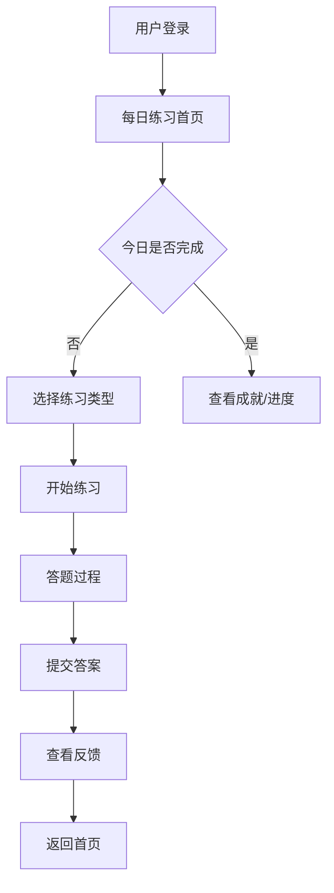

# 每日练习功能完整性分析与实现代办清单

## 📊 项目概述

**项目名称**: CotigoAI 每日练习功能  
**分析日期**: 2024年12月  
**分析师**: 交互设计专家  
**目标用户**: 希望提升批判性思维能力的学习者  

## 🎯 功能架构现状分析

### 1. 当前功能架构完整性评估

#### ✅ 已实现的核心功能
- **用户认证系统**: 基于NextAuth的完整认证流程
- **五大思维维度**: 完整的思维类型定义和种子数据
- **练习生成系统**: AI驱动的个性化题目生成
- **进度跟踪**: 基本的学习进度和连续打卡记录
- **反馈机制**: 练习结果分析和AI反馈
- **响应式设计**: 移动端适配的基础UI组件

#### ❌ 功能缺失和不完整项
- **智能推荐系统**: 推荐逻辑过于简单，缺乏深度个性化
- **学习路径规划**: 缺乏系统性的学习路径设计
- **社交学习功能**: 无用户互动和社区功能
- **多模态学习内容**: 仅支持文本，缺乏视频、音频等
- **高级分析报告**: 学习数据分析不够深入
- **离线学习支持**: 无离线功能
- **学习提醒系统**: 通知机制不完善

### 2. 用户交互流程分析

#### 🔄 当前交互流程

#### 🎨 交互体验优化空间
- **入口体验**: 缺乏引导性的onboarding流程
- **练习选择**: 类型选择界面信息密度过高
- **答题体验**: 缺乏实时提示和进度感知
- **反馈展示**: 反馈信息过于技术化，不够友好
- **激励机制**: 成就系统单一，缺乏多样化激励

## 🚀 详细功能实现代办清单

### Phase 1: 基础体验优化 (优先级: 🔴 高)

#### 1.1 用户引导与入门体验
- [ ] **新用户引导流程**
  - [ ] 设计5步式引导教程
  - [ ] 实现交互式思维能力测评
  - [ ] 创建个性化学习目标设定
  - [ ] 添加首次练习体验优化

- [ ] **智能难度适配**
  - [ ] 实现动态难度调整算法
  - [ ] 基于用户表现的实时难度优化
  - [ ] 添加难度选择的可视化反馈

#### 1.2 练习体验核心优化
- [ ] **答题界面增强**
  - [ ] 添加题目进度指示器
  - [ ] 实现答题时间可视化
  - [ ] 添加答题信心度滑块
  - [ ] 实现题目收藏和标记功能

- [ ] **实时反馈系统**
  - [ ] 答题过程中的即时提示
  - [ ] 错误答案的温和纠正机制
  - [ ] 正确答案的积极强化反馈

#### 1.3 移动端体验优化
- [ ] **触控交互优化**
  - [ ] 优化按钮点击区域(最小44px)
  - [ ] 添加手势导航支持
  - [ ] 实现滑动切换题目功能

- [ ] **性能优化**
  - [ ] 实现题目预加载机制
  - [ ] 添加离线缓存支持
  - [ ] 优化图片和资源加载

### Phase 2: 个性化学习系统 (优先级: 🟡 中)

#### 2.1 智能推荐系统升级
- [ ] **用户画像构建**
  - [ ] 实现多维度学习偏好分析
  - [ ] 构建知识点掌握度模型
  - [ ] 添加学习时间偏好记录

- [ ] **推荐算法优化**
  - [ ] 实现协同过滤推荐
  - [ ] 添加内容基础推荐
  - [ ] 构建混合推荐系统

#### 2.2 学习路径规划
- [ ] **个性化路径生成**
  - [ ] 基于能力评估的路径规划
  - [ ] 实现阶段性学习目标设定
  - [ ] 添加路径进度可视化

- [ ] **适应性学习**
  - [ ] 实现学习速度自适应
  - [ ] 添加薄弱环节强化训练
  - [ ] 构建知识点关联图谱

#### 2.3 多模态学习内容
- [ ] **内容类型扩展**
  - [ ] 添加视频解析功能
  - [ ] 实现音频练习模式
  - [ ] 支持图表分析题型

- [ ] **交互式学习组件**
  - [ ] 实现拖拽式逻辑构建
  - [ ] 添加思维导图绘制工具
  - [ ] 创建论证结构可视化

### Phase 3: 社交与激励系统 (优先级: 🟢 中低)

#### 3.1 社交学习功能
- [ ] **学习社区**
  - [ ] 实现学习小组功能
  - [ ] 添加讨论区和问答
  - [ ] 创建学习伙伴匹配系统

- [ ] **协作学习**
  - [ ] 实现题目分享功能
  - [ ] 添加学习笔记共享
  - [ ] 创建群体挑战活动

#### 3.2 游戏化激励机制
- [ ] **成就系统升级**
  - [ ] 设计多层级成就体系
  - [ ] 实现稀有成就和隐藏成就
  - [ ] 添加成就展示和分享功能

- [ ] **积分与等级系统**
  - [ ] 实现经验值和等级机制
  - [ ] 添加虚拟货币系统
  - [ ] 创建学习商店和奖励兑换

#### 3.3 竞技与排行
- [ ] **排行榜系统**
  - [ ] 实现多维度排行榜
  - [ ] 添加好友排行功能
  - [ ] 创建周期性竞赛活动

### Phase 4: 高级分析与智能化 (优先级: 🔵 低)

#### 4.1 学习分析报告
- [ ] **深度数据分析**
  - [ ] 实现学习行为分析
  - [ ] 添加认知能力评估报告
  - [ ] 创建学习效果预测模型

- [ ] **可视化报告**
  - [ ] 设计交互式数据图表
  - [ ] 实现学习轨迹可视化
  - [ ] 添加能力雷达图展示

#### 4.2 AI导师系统
- [ ] **智能对话助手**
  - [ ] 实现学习问题智能解答
  - [ ] 添加学习策略建议
  - [ ] 创建情感支持对话

- [ ] **自适应教学**
  - [ ] 实现教学策略个性化
  - [ ] 添加学习风格识别
  - [ ] 构建认知负荷管理

## 📱 移动端适配专项清单

### 响应式设计优化
- [ ] **布局适配**
  - [ ] 优化小屏幕下的信息层级
  - [ ] 实现自适应字体大小
  - [ ] 添加横屏模式支持

- [ ] **交互优化**
  - [ ] 实现下拉刷新功能
  - [ ] 添加无限滚动加载
  - [ ] 优化键盘弹出体验

### PWA功能实现
- [ ] **离线支持**
  - [ ] 实现Service Worker缓存
  - [ ] 添加离线练习模式
  - [ ] 创建数据同步机制

- [ ] **原生体验**
  - [ ] 添加到主屏幕功能
  - [ ] 实现推送通知
  - [ ] 支持后台同步

## 🎨 UI/UX设计改进清单

### 视觉设计优化
- [ ] **设计系统完善**
  - [ ] 统一色彩规范和使用指南
  - [ ] 完善图标库和插画系统
  - [ ] 创建动效设计规范

- [ ] **可访问性改进**
  - [ ] 添加高对比度模式
  - [ ] 实现屏幕阅读器支持
  - [ ] 优化键盘导航体验

### 交互动效
- [ ] **微交互设计**
  - [ ] 添加页面转场动画
  - [ ] 实现按钮点击反馈
  - [ ] 创建加载状态动画

## 🔧 技术架构优化清单

### 性能优化
- [ ] **前端性能**
  - [ ] 实现代码分割和懒加载
  - [ ] 优化图片加载和压缩
  - [ ] 添加CDN加速支持

- [ ] **后端优化**
  - [ ] 实现API响应缓存
  - [ ] 添加数据库查询优化
  - [ ] 构建分布式架构支持

### 数据安全
- [ ] **隐私保护**
  - [ ] 实现数据加密存储
  - [ ] 添加用户数据导出功能
  - [ ] 创建数据删除机制

## 📊 数据驱动改进清单

### 用户行为分析
- [ ] **埋点系统**
  - [ ] 实现用户行为追踪
  - [ ] 添加学习路径分析
  - [ ] 创建转化漏斗分析

- [ ] **A/B测试框架**
  - [ ] 实现功能灰度发布
  - [ ] 添加用户体验对比测试
  - [ ] 创建数据驱动决策流程

### 学习效果评估
- [ ] **效果测量**
  - [ ] 实现学习成果量化
  - [ ] 添加长期记忆测试
  - [ ] 创建能力提升评估

## 🎯 实施优先级和时间规划

### 第一阶段 (1-2个月)
**重点**: 基础体验优化
- 新用户引导流程
- 答题界面增强
- 移动端触控优化
- 实时反馈系统

### 第二阶段 (2-3个月)
**重点**: 个性化学习
- 智能推荐系统升级
- 学习路径规划
- 多模态内容支持

### 第三阶段 (3-4个月)
**重点**: 社交与激励
- 学习社区功能
- 游戏化机制完善
- 竞技排行系统

### 第四阶段 (4-6个月)
**重点**: 智能化升级
- 深度学习分析
- AI导师系统
- 高级个性化功能

## 📈 成功指标定义

### 用户参与度指标
- 日活跃用户数 (DAU)
- 用户留存率 (1日、7日、30日)
- 平均会话时长
- 练习完成率

### 学习效果指标
- 用户能力提升幅度
- 知识点掌握度
- 学习目标达成率
- 用户满意度评分

### 产品健康度指标
- 功能使用率分布
- 用户反馈评分
- 技术性能指标
- 业务转化指标

## 🔄 持续优化机制

### 用户反馈收集
- [ ] 实现应用内反馈系统
- [ ] 定期用户访谈计划
- [ ] 用户行为数据分析
- [ ] 竞品分析和对比

### 迭代优化流程
- [ ] 建立敏捷开发流程
- [ ] 实现快速原型验证
- [ ] 数据驱动的决策机制
- [ ] 用户体验持续监控

---

**文档版本**: v1.0  
**最后更新**: 2024年12月  
**负责团队**: 产品设计团队  
**审核状态**: 待审核  

> 💡 **注意**: 此清单应根据实际开发资源和业务优先级进行调整，建议采用敏捷开发方式，小步快跑，持续迭代优化。