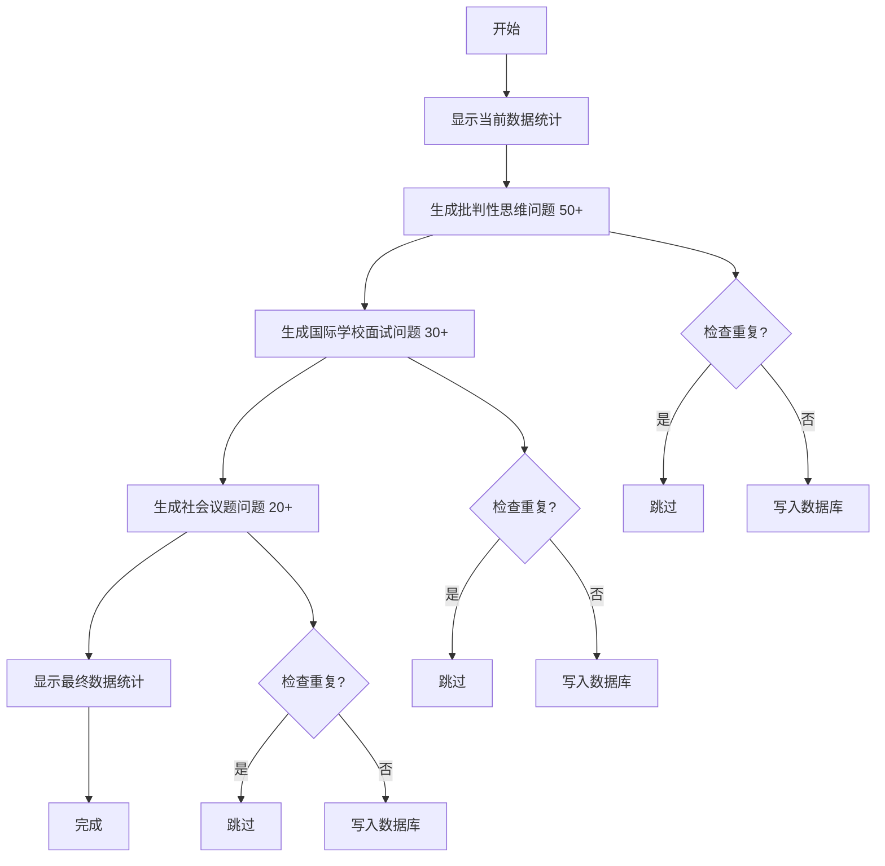

# 每日一问数据生成指南

## 快速开始

### 测试脚本（推荐先运行）

```bash
npm run test:daily-questions
```

这将验证：
- ✅ AI 模型连接正常
- ✅ 数据库写入正常
- ✅ 脚本依赖完整

预期输出：
```
🧪 测试问题生成功能...

1️⃣ 测试 AI 模型调用...
✅ AI 模型响应成功

2️⃣ 测试数据库写入...
✅ 数据库写入成功

3️⃣ 清理测试数据...
✅ 测试数据已清理

🎉 所有测试通过！脚本可以正常运行。
```

### 正式生成数据

```bash
npm run generate:daily-questions
```

⏱️ **预计时间**: 3-5 分钟（生成约 100 个问题）

💰 **预计成本**: ¥0.5-1.5（基于 Deepseek API 定价）

## 数据生成目标

| 类别 | 目标数量 | 覆盖范围 |
|------|---------|---------|
| **批判性思维** | 50+ 题 | 5 维度 × 3 难度 |
| **国际学校面试** | 30+ 题 | 10 大主题 |
| **社会热点议题** | 20+ 题 | 10 大议题 |
| **总计** | **100+ 题** | 全面覆盖 |

## 生成内容详情

### 1. 批判性思维 (critical_thinking)

#### 五大思维维度
1. **多维归因与利弊权衡** (causal_analysis)
   - 分析因果关系，识别混淆因素
   - 权衡多方面利弊

2. **前提质疑与方法批判** (premise_challenge)
   - 识别隐含前提
   - 质疑论证合理性

3. **谬误检测** (fallacy_detection)
   - 识别逻辑谬误
   - 避免思维陷阱

4. **迭代反思** (iterative_reflection)
   - 培养元认知能力
   - 持续改进思维质量

5. **知识迁移** (connection_transfer)
   - 识别深层结构相似性
   - 跨领域应用知识

#### 三种难度级别
- **beginner**: 概念清晰，情境简单
- **intermediate**: 需要思维深度，情境复杂
- **advanced**: 深度分析，情境多元复杂

### 2. 国际学校面试 (interview)

Top 10 面试主题：
1. 个人成长与挑战
2. 领导力与团队合作
3. 全球化与文化理解
4. 创新思维与问题解决
5. 社会责任与公民意识
6. 学术兴趣与职业规划
7. 道德困境与价值选择
8. 科技发展与人类未来
9. 环境保护与可持续发展
10. 艺术人文与批判性思维

### 3. 社会热点议题 (social_issue)

10 大议题：
1. AI 与就业市场
2. 教育公平与机会
3. 气候变化与行动
4. 隐私保护与数据安全
5. 贫富差距与社会流动
6. 心理健康与社会压力
7. 网络治理与言论自由
8. 老龄化社会挑战
9. 性别平等与多元包容
10. 城市化与生活质量

## 问题质量保证

### AI Prompt 设计原则
1. **专业角色定位**: 每个类别都有专门的专家身份
2. **明确质量要求**: 强调开放性、思维深度、现实性
3. **结构化输出**: 使用 JSON Schema 约束格式
4. **难度适配**: 根据目标难度调整问题复杂度

### 去重机制
- 检查问题前 50 字符是否重复
- 自动跳过已存在的相似问题
- 保留所有历史数据

### 数据验证
- JSON 格式验证
- 必填字段完整性检查
- 类别和难度枚举值验证

## 执行流程



## 示例输出

```
🚀 AI驱动的每日一问数据生成脚本
============================================================

📊 当前数据统计:
  critical_thinking: 0 个问题
  interview: 0 个问题
  social_issue: 0 个问题
  总计: 0 个问题

📚 开始生成批判性思维问题...

  处理维度: 多维归因与利弊权衡
    难度: beginner
      ✅ 已生成问题 1/50
    难度: intermediate
      ✅ 已生成问题 2/50
    难度: advanced
      ✅ 已生成问题 3/50

  处理维度: 前提质疑与方法批判
    难度: beginner
      ✅ 已生成问题 4/50
    ...

✅ 批判性思维问题生成完成: 52 个新问题, 0 个重复跳过

🎓 开始生成国际学校面试问题...

  处理主题: 个人成长与挑战
    ✅ 已生成问题 1/30
    ...

✅ 面试问题生成完成: 31 个新问题, 0 个重复跳过

🌍 开始生成社会议题问题...

  处理议题: AI与就业市场
    ✅ 已生成问题 1/20
    ...

✅ 社会议题问题生成完成: 21 个问题, 0 个重复跳过

============================================================
📊 最终数据统计:
  critical_thinking: 52 个问题
  interview: 31 个问题
  social_issue: 21 个问题
  总计: 104 个问题
  新增: 104 个问题

✅ 数据生成完成!
```

## 常见问题

### Q1: 如何查看已生成的问题？

**方法1**: 使用 Prisma Studio
```bash
npm run db:studio
```
打开 `daily_critical_questions` 表查看

**方法2**: 使用 SQL 查询
```sql
SELECT category, difficulty, COUNT(*) as count
FROM daily_critical_questions
GROUP BY category, difficulty
ORDER BY category, difficulty;
```

### Q2: 如何修改生成数量？

编辑 `scripts/generate-daily-questions.ts` 中的主函数：

```typescript
async function main() {
  // ...
  await generateCriticalThinkingQuestions(100)  // 改为 100 题
  await generateInterviewQuestions(50)          // 改为 50 题
  await generateSocialIssueQuestions(30)        // 改为 30 题
}
```

### Q3: 生成的问题质量不满意怎么办？

**方法1**: 调整 Prompt
- 编辑 `PROMPTS` 对象中的提示词
- 增加更具体的质量要求
- 提供示例问题

**方法2**: 调整 Temperature
```typescript
const response = await aiRouter.chat(messages, {
  temperature: 0.7,  // 降低随机性，提高一致性
  max_tokens: 1000
})
```

**方法3**: 切换 AI 模型
```env
# .env
ACTIVE_AI_MODEL="qwen3-max"  # 切换到 Qwen
```

### Q4: 如何删除测试数据？

```sql
-- 删除所有数据（谨慎操作！）
DELETE FROM daily_critical_questions;

-- 删除特定类别
DELETE FROM daily_critical_questions WHERE category = 'critical_thinking';

-- 删除特定难度
DELETE FROM daily_critical_questions WHERE difficulty = 'beginner';
```

### Q5: 脚本执行时间过长怎么办？

**原因**: API 调用频率限制或网络延迟

**解决方案**:
1. 减少每次生成的数量
2. 增加 `setTimeout` 延迟时间
3. 分批执行（多次运行脚本）

### Q6: 如何确保不删除历史数据？

脚本设计保证：
- ✅ 只执行 `CREATE` 操作
- ✅ 不执行 `DELETE` 或 `UPDATE`
- ✅ 去重机制跳过已有数据
- ✅ 所有操作都在事务中（Prisma 自动管理）

## 维护建议

### 定期补充
建议每月运行一次，保持问题库新鲜度：
```bash
# 每月1号执行
npm run generate:daily-questions
```

### 质量审核
生成后人工抽查：
1. 打开 Prisma Studio
2. 随机查看 10-20 个问题
3. 检查问题质量、标签准确性
4. 删除或修改低质量问题

### 数据清理
定期清理过时或低质量问题：
```sql
-- 查看使用频率最低的问题
SELECT id, question, usageCount
FROM daily_critical_questions
ORDER BY usageCount ASC
LIMIT 20;

-- 删除从未使用的问题（可选）
DELETE FROM daily_critical_questions
WHERE usageCount = 0 AND createdAt < NOW() - INTERVAL '6 months';
```

### 性能优化
1. 监控 AI API 调用成本
2. 优化 Prompt 以减少 token 消耗
3. 使用更便宜的模型（如 Deepseek）

## 技术架构

```
┌─────────────────────────────────────────┐
│  generate-daily-questions.ts            │
│  (主脚本)                                │
└───────────┬─────────────────────────────┘
            │
            ├──► AI Router (lib/ai/router.ts)
            │    ├──► Deepseek Service
            │    └──► Qwen Service
            │
            ├──► Prisma Client
            │    └──► PostgreSQL Database
            │         └──► daily_critical_questions 表
            │
            └──► Prompt Templates
                 ├──► critical_thinking
                 ├──► interview
                 └──► social_issue
```

## 相关文件

| 文件路径 | 作用 |
|---------|------|
| `scripts/generate-daily-questions.ts` | 主生成脚本 |
| `scripts/test-daily-questions.ts` | 测试脚本 |
| `scripts/README-daily-questions.md` | 详细文档 |
| `src/lib/ai/router.ts` | AI 模型路由 |
| `src/app/api/daily-questions/route.ts` | API 路由 |
| `src/components/learn/AIQuestionChatbox.tsx` | 前端组件 |
| `prisma/schema.prisma` | 数据库模型 |

## 联系与支持

如有问题，请查看：
1. 详细文档: `scripts/README-daily-questions.md`
2. 项目文档: `CLAUDE.md`
3. GitHub Issues: [创建 Issue](https://github.com/your-repo/issues)

## 许可证

MIT License - Cogito AI Project
