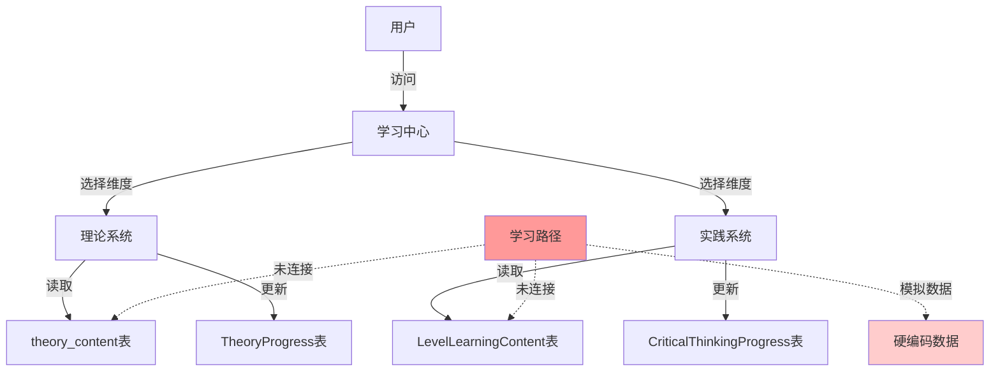

# 个性化学习路径系统设计方案
## Personalized Learning Path System Design

**文档版本**: v1.0
**创建日期**: 2025-10-22
**设计专家角色**: 批判性教育和交互专家
**设计目标**: 整合理论知识学习与实践练习，构建自适应个性化学习路径系统

---

## 一、执行摘要 (Executive Summary)

### 1.1 系统愿景

打造智能化、个性化的批判性思维学习路径系统，通过整合**理论知识学习**（theory_content）和**实践内容学习**（LevelLearningContent），为用户提供：

- **自适应学习路径**: 根据用户表现动态调整学习难度和内容顺序
- **理论与实践融合**: 无缝连接5大思维维度的理论学习和实战练习
- **智能推荐引擎**: 基于用户强项/弱项提供个性化推荐
- **进度可视化**: 清晰的学习里程碑和成就系统

### 1.2 核心价值主张

| 当前痛点 | 解决方案 | 用户价值 |
|---------|---------|---------|
| 学习路径使用模拟数据 | 连接真实的theory_content和LevelLearningContent表 | 真实内容支撑的学习体验 |
| 缺乏个性化适配 | 自适应算法根据用户进度动态调整 | 因材施教，提高学习效率 |
| 理论与实践割裂 | 智能编排理论-实践-反思循环 | 知识内化，深度掌握 |
| 无数据驱动推荐 | AI推荐引擎分析用户表现 | 精准定位学习重点 |
| 进度追踪不完善 | 多维度进度追踪系统 | 清晰的成长路径可视化 |

### 1.3 设计原则

1. **渐进式学习** (Progressive Learning): Level 1 → Level 5，难度逐步递进
2. **螺旋式深化** (Spiral Deepening): 理论 → 实践 → 反思 → 高级理论的循环
3. **数据驱动** (Data-Driven): 所有决策基于用户实际表现数据
4. **用户中心** (User-Centric): 界面简洁、反馈及时、激励明确
5. **文化适配** (Culturally Adapted): 符合中文学习者的思维习惯

---

## 二、现状分析 (Current State Analysis)

### 2.1 现有系统架构梳理

#### 已实现功能模块
```
批判性思维学习系统
├── 5大核心维度 (ThinkingType)
│   ├── causal_analysis (多维归因与利弊权衡)
│   ├── premise_challenge (前提质疑与方法批判)
│   ├── fallacy_detection (谬误检测)
│   ├── iterative_reflection (迭代反思)
│   └── connection_transfer (知识迁移)
│
├── 理论学习系统 (Theory System)
│   ├── 数据源: theory_content表
│   ├── 结构: 5 dimensions × 5 levels × 3 sections
│   ├── 章节: 核心概念、思维模型、实例演示
│   ├── 进度追踪: TheoryProgress表
│   └── UI组件: TheorySystemContainerV2, TheoryLevelCard
│
├── 实践练习系统 (Practice System)
│   ├── 数据源: LevelLearningContent表
│   ├── UI组件: PracticeSessionV2
│   └── 评估: AI反馈系统
│
├── 每日练习 (Daily Practice)
│   ├── 数据: PracticeSession, PracticeQuestion
│   ├── 激励: DailyStreak, 成就系统
│   └── UI: DailyPracticeMain
│
└── 学习路径 (Learning Path) ⚠️ 当前使用模拟数据
    ├── 文件: LearningPath.tsx (698行)
    ├── 数据: 硬编码的6个步骤
    └── 推荐: 未连接真实用户数据
```

#### 数据库表结构
```sql
-- 理论内容表 (已发布25条记录)
theory_content
├── id (cuid)
├── thinkingTypeId (5个维度)
├── level (1-5)
├── title, subtitle, description
├── learningObjectives (JSON)
├── conceptsIntro, conceptsContent (JSON)
├── modelsIntro, modelsContent (JSON)
├── demonstrationsIntro, demonstrationsContent (JSON)
├── estimatedTime (分钟)
├── difficulty (beginner|intermediate|advanced)
├── isPublished (Boolean)
└── publishedAt (DateTime)

-- 学习内容表
LevelLearningContent
├── id (cuid)
├── thinkingTypeId
├── level (1-5)
├── contentType (concepts|frameworks|examples|practice_guide)
├── title, description
├── content (JSON)
├── estimatedTime
├── orderIndex
├── tags (String[])
└── prerequisites (String[])

-- 理论进度表
TheoryProgress
├── id (cuid)
├── userId
├── theoryContentId (FK to theory_content)
├── status (not_started|in_progress|completed)
├── progressPercent (0-100)
├── sectionsCompleted (JSON: {concepts, models, demonstrations})
├── timeSpent (分钟)
├── startedAt, completedAt, lastViewedAt
└── createdAt, updatedAt

-- 批判性思维进度表
CriticalThinkingProgress
├── userId
├── thinkingTypeId
├── currentLevel (1-5)
├── questionsCompleted
├── progressPercentage
└── updatedAt
```

### 2.2 关键问题识别

#### 🔴 Critical Issues (严重问题)

1. **数据孤岛问题**
   - **现象**: LearningPath组件使用硬编码的模拟数据（198-270行）
   - **影响**: 无法反映真实的25条theory_content和LevelLearningContent数据
   - **代码位置**: `src/components/learn/LearningPath.tsx:198-270`

2. **理论与实践割裂**
   - **现象**: 理论系统（`/theory/[level]`）和实践系统（`/practice`）独立运行
   - **影响**: 用户无法看到知识的应用闭环
   - **缺失**: 理论学习后的配套练习推荐机制

3. **缺乏自适应逻辑**
   - **现象**: 所有Level默认解锁，无prerequisite检查
   - **影响**: 用户可能跳过基础直接学高级内容，导致学习困难
   - **代码位置**: `TheoryLevelCard.tsx:241` - `unlocked={true}` 硬编码

#### 🟡 Medium Issues (中等问题)

4. **推荐系统空转**
   - **现象**: PersonalizedRecommendation接口定义完善但未使用真实数据
   - **影响**: 无法基于用户弱项/强项提供精准推荐
   - **代码位置**: `LearningPath.tsx:29-38, 272-321`

5. **进度追踪不完整**
   - **现象**: TheoryProgress追踪单个theory_content，缺乏跨维度整体进度
   - **影响**: 用户看不到完整的学习地图
   - **缺失**: 整体学习路径完成度指标

6. **估算时间不准确**
   - **现象**: `estimatedTime`存在但未动态更新
   - **影响**: 用户时间规划困难
   - **优化**: 根据历史数据调整预估时间

#### 🟢 Minor Issues (次要问题)

7. **UI交互待优化**
   - **现象**: 学习路径步骤的locked状态UI反馈不明确
   - **优化**: 增强视觉引导，明确前置条件

8. **缺乏里程碑庆祝**
   - **现象**: 完成Level无特殊反馈
   - **优化**: 增加成就解锁动画

### 2.3 数据流现状



**问题**: 学习路径与数据源断连，无法形成数据闭环

---

## 三、目标系统架构 (Target Architecture)

### 3.1 系统架构图

```mermaid
graph TB
    subgraph "前端层 Frontend Layer"
        UI[学习路径UI<br/>LearningPathContainer]
        Progress[进度仪表板<br/>ProgressDashboard]
        Recommendations[推荐卡片<br/>RecommendationCards]
    end

    subgraph "API层 API Layer"
        GenerateAPI[/api/learning-path/generate<br/>生成个性化路径]
        ProgressAPI[/api/learning-path/progress<br/>更新进度]
        RecommendAPI[/api/learning-path/recommendations<br/>获取推荐]
        AnalyticsAPI[/api/learning-path/analytics<br/>学习分析]
    end

    subgraph "服务层 Service Layer"
        PathEngine[路径生成引擎<br/>PathGenerationEngine]
        AdaptiveAlgo[自适应算法<br/>AdaptiveAlgorithm]
        RecommendEngine[推荐引擎<br/>RecommendationEngine]
        AnalyticsService[分析服务<br/>AnalyticsService]
    end

    subgraph "数据层 Data Layer"
        TheoryContent[(theory_content<br/>25条记录)]
        LevelContent[(LevelLearningContent)]
        TheoryProgress[(TheoryProgress)]
        CriticalProgress[(CriticalThinkingProgress)]
        LearningPathState[(LearningPathState<br/>NEW)]
        UserPreferences[(UserPreferences<br/>NEW)]
    end

    UI --> GenerateAPI
    UI --> ProgressAPI
    Recommendations --> RecommendAPI
    Progress --> AnalyticsAPI

    GenerateAPI --> PathEngine
    ProgressAPI --> PathEngine
    RecommendAPI --> RecommendEngine
    AnalyticsAPI --> AnalyticsService

    PathEngine --> AdaptiveAlgo
    PathEngine --> TheoryContent
    PathEngine --> LevelContent
    PathEngine --> LearningPathState

    AdaptiveAlgo --> TheoryProgress
    AdaptiveAlgo --> CriticalProgress
    AdaptiveAlgo --> UserPreferences

    RecommendEngine --> TheoryProgress
    RecommendEngine --> CriticalProgress
    RecommendEngine --> TheoryContent
```

### 3.2 核心组件设计

#### 3.2.1 路径生成引擎 (PathGenerationEngine)

**职责**: 根据用户当前状态生成个性化学习路径

**输入参数**:
```typescript
interface PathGenerationInput {
  userId: string;
  thinkingTypeId?: string; // 可选：特定维度路径
  targetLevel?: number;     // 可选：目标Level
  timeAvailable?: number;   // 可选：可用时间（分钟）
  learningStyle?: 'theory_first' | 'practice_first' | 'balanced';
}
```

**核心逻辑**:
```typescript
class PathGenerationEngine {
  async generatePath(input: PathGenerationInput): Promise<LearningPath> {
    // 1. 获取用户当前状态
    const userState = await this.getUserState(input.userId);

    // 2. 确定学习维度和起始Level
    const dimensions = this.selectDimensions(input, userState);
    const startLevel = this.determineStartLevel(userState);

    // 3. 生成路径步骤序列
    const steps: PathStep[] = [];

    for (const dimension of dimensions) {
      for (let level = startLevel; level <= (input.targetLevel || 5); level++) {
        // 3.1 添加理论学习步骤
        const theoryStep = await this.createTheoryStep(dimension, level);
        steps.push(theoryStep);

        // 3.2 添加实践练习步骤
        const practiceSteps = await this.createPracticeSteps(dimension, level);
        steps.push(...practiceSteps);

        // 3.3 添加评估步骤（每个Level结束）
        if (level < 5) {
          const assessmentStep = this.createAssessmentStep(dimension, level);
          steps.push(assessmentStep);
        }

        // 3.4 添加反思步骤（Level 3和5）
        if (level === 3 || level === 5) {
          const reflectionStep = this.createReflectionStep(dimension, level);
          steps.push(reflectionStep);
        }
      }
    }

    // 4. 应用自适应算法调整顺序
    const adaptedSteps = await this.applyAdaptiveAlgorithm(steps, userState);

    // 5. 计算prerequisite关系
    const stepsWithPrereqs = this.calculatePrerequisites(adaptedSteps);

    // 6. 生成路径元数据
    const metadata = this.generateMetadata(stepsWithPrereqs, input);

    return {
      id: generateId(),
      userId: input.userId,
      steps: stepsWithPrereqs,
      metadata,
      createdAt: new Date(),
      status: 'active'
    };
  }
}
```

#### 3.2.2 自适应算法 (AdaptiveAlgorithm)

**职责**: 根据用户表现动态调整学习难度和内容顺序

**调整策略矩阵**:

| 用户表现 | 理论掌握度 | 实践正确率 | 自适应动作 |
|---------|-----------|-----------|----------|
| 优秀 | >85% | >80% | 跳过部分基础练习，提前解锁下一Level |
| 良好 | 70-85% | 65-80% | 标准路径，适当增加巩固练习 |
| 中等 | 50-70% | 50-65% | 增加示例演示，延长当前Level停留时间 |
| 困难 | <50% | <50% | 降级到更基础内容，增加引导式练习 |

**核心算法**:
```typescript
class AdaptiveAlgorithm {
  async adjustPath(
    steps: PathStep[],
    userState: UserState
  ): Promise<PathStep[]> {
    const adjustedSteps: PathStep[] = [];

    for (const step of steps) {
      // 1. 评估用户在该维度的表现
      const performance = this.evaluatePerformance(
        step.thinkingTypeId,
        userState
      );

      // 2. 根据表现调整步骤
      if (performance.score > 0.85) {
        // 优秀：简化路径
        if (step.type === 'practice' && step.difficulty === 'beginner') {
          continue; // 跳过基础练习
        }
        step.estimatedTime *= 0.8; // 减少20%时间
      } else if (performance.score < 0.5) {
        // 困难：增强路径
        if (step.type === 'learning') {
          // 添加额外的概念复习步骤
          adjustedSteps.push(this.createReviewStep(step));
        }
        step.estimatedTime *= 1.3; // 增加30%时间
      }

      adjustedSteps.push(step);

      // 3. 动态插入强化步骤
      if (this.needsReinforcement(step, performance)) {
        const reinforcement = this.createReinforcementStep(step);
        adjustedSteps.push(reinforcement);
      }
    }

    return adjustedSteps;
  }

  private evaluatePerformance(
    thinkingTypeId: string,
    userState: UserState
  ): PerformanceMetrics {
    const progress = userState.criticalThinkingProgress.find(
      p => p.thinkingTypeId === thinkingTypeId
    );

    const theoryProgress = userState.theoryProgress.filter(
      t => t.theoryContentId.startsWith(thinkingTypeId)
    );

    return {
      score: progress?.progressPercentage / 100 || 0,
      questionsCompleted: progress?.questionsCompleted || 0,
      averageTheoryProgress: this.calculateAverage(
        theoryProgress.map(t => t.progressPercent)
      ),
      timeEfficiency: this.calculateTimeEfficiency(theoryProgress),
      strengthAreas: this.identifyStrengths(userState, thinkingTypeId),
      weaknessAreas: this.identifyWeaknesses(userState, thinkingTypeId)
    };
  }
}
```

#### 3.2.3 推荐引擎 (RecommendationEngine)

**职责**: 基于用户数据生成智能学习推荐

**推荐类型**:
1. **弱项强化** (weakness): 针对表现较差的维度
2. **强项拓展** (strength): 深化优势领域
3. **下一步建议** (next_step): 最佳学习路径
4. **复习提醒** (review): 遗忘曲线管理

**推荐算法**:
```typescript
class RecommendationEngine {
  async generateRecommendations(
    userId: string
  ): Promise<PersonalizedRecommendation[]> {
    const userState = await this.getUserState(userId);
    const recommendations: PersonalizedRecommendation[] = [];

    // 1. 弱项分析推荐
    const weaknesses = this.analyzeWeaknesses(userState);
    for (const weakness of weaknesses) {
      recommendations.push({
        type: 'weakness',
        priority: 'high',
        title: `强化${weakness.dimensionName}`,
        description: `您在该维度的掌握度为${weakness.score}%，建议重点学习`,
        action: `复习Level ${weakness.suggestedLevel}`,
        href: `/learn/critical-thinking/${weakness.thinkingTypeId}/theory/${weakness.suggestedLevel}`,
        thinkingTypeId: weakness.thinkingTypeId,
        metadata: {
          currentScore: weakness.score,
          targetScore: 70,
          estimatedTime: weakness.estimatedTime
        }
      });
    }

    // 2. 下一步最优路径推荐
    const nextStep = this.calculateNextOptimalStep(userState);
    if (nextStep) {
      recommendations.push({
        type: 'next_step',
        priority: 'high',
        title: nextStep.title,
        description: nextStep.rationale,
        action: nextStep.actionText,
        href: nextStep.url,
        thinkingTypeId: nextStep.thinkingTypeId,
        metadata: nextStep.metadata
      });
    }

    // 3. 复习提醒（基于遗忘曲线）
    const reviewItems = this.calculateReviewNeeds(userState);
    for (const item of reviewItems) {
      recommendations.push({
        type: 'review',
        priority: 'medium',
        title: `复习${item.contentTitle}`,
        description: `距离上次学习已${item.daysSince}天，建议复习巩固`,
        action: '开始复习',
        href: item.contentUrl,
        metadata: {
          lastViewedAt: item.lastViewedAt,
          daysSince: item.daysSince,
          retentionProbability: item.retentionProbability
        }
      });
    }

    // 4. 强项拓展推荐
    const strengths = this.analyzeStrengths(userState);
    if (strengths.length > 0) {
      const topStrength = strengths[0];
      recommendations.push({
        type: 'strength',
        priority: 'low',
        title: `深化${topStrength.dimensionName}优势`,
        description: `您在该维度表现优秀（${topStrength.score}%），可尝试高级内容`,
        action: `挑战Level ${topStrength.nextLevel}`,
        href: `/learn/critical-thinking/${topStrength.thinkingTypeId}/theory/${topStrength.nextLevel}`,
        thinkingTypeId: topStrength.thinkingTypeId
      });
    }

    // 5. 按优先级排序
    return recommendations.sort((a, b) => {
      const priorityMap = { high: 3, medium: 2, low: 1 };
      return priorityMap[b.priority] - priorityMap[a.priority];
    });
  }

  private analyzeWeaknesses(userState: UserState): WeaknessAnalysis[] {
    const weaknesses: WeaknessAnalysis[] = [];

    for (const progress of userState.criticalThinkingProgress) {
      if (progress.progressPercentage < 50) {
        weaknesses.push({
          thinkingTypeId: progress.thinkingTypeId,
          dimensionName: this.getDimensionName(progress.thinkingTypeId),
          score: progress.progressPercentage,
          suggestedLevel: Math.max(1, progress.currentLevel - 1),
          estimatedTime: 45, // 分钟
          reason: '掌握度低于50%，建议从更基础的内容开始'
        });
      }
    }

    return weaknesses.sort((a, b) => a.score - b.score);
  }

  private calculateReviewNeeds(
    userState: UserState
  ): ReviewItem[] {
    const reviewItems: ReviewItem[] = [];

    for (const theoryProgress of userState.theoryProgress) {
      if (theoryProgress.status === 'completed') {
        const daysSince = this.daysSince(theoryProgress.completedAt);

        // 遗忘曲线：1天、3天、7天、14天、30天
        const reviewIntervals = [1, 3, 7, 14, 30];
        const shouldReview = reviewIntervals.some(interval =>
          Math.abs(daysSince - interval) <= 1
        );

        if (shouldReview) {
          reviewItems.push({
            contentId: theoryProgress.theoryContentId,
            contentTitle: await this.getContentTitle(theoryProgress.theoryContentId),
            contentUrl: this.buildContentUrl(theoryProgress.theoryContentId),
            lastViewedAt: theoryProgress.lastViewedAt,
            daysSince,
            retentionProbability: this.calculateRetention(daysSince)
          });
        }
      }
    }

    return reviewItems;
  }
}
```

### 3.3 数据模型设计

#### 3.3.1 新增表结构

**LearningPathState表** (存储用户学习路径状态)
```prisma
model LearningPathState {
  id        String   @id @default(cuid())
  userId    String
  user      User     @relation(fields: [userId], references: [id], onDelete: Cascade)

  // 路径元数据
  pathType  String   @default("adaptive") // adaptive | linear | custom
  status    String   @default("active")   // active | paused | completed

  // 当前进度
  currentStepId     String?
  currentStepIndex  Int      @default(0)
  totalSteps        Int
  completedSteps    Int      @default(0)

  // 路径配置
  targetDimensions  String[] // 目标学习维度
  learningStyle     String   @default("balanced") // theory_first | practice_first | balanced
  difficultyLevel   String   @default("auto")     // auto | beginner | intermediate | advanced

  // 时间统计
  totalTimeSpent    Int      @default(0) // 分钟
  estimatedTimeLeft Int?

  // 路径步骤（JSON）
  pathSteps         Json     // PathStep[]序列化

  // 自适应参数
  adaptiveConfig    Json?    // 自适应算法配置

  // 时间戳
  startedAt         DateTime @default(now())
  lastAccessedAt    DateTime @default(now())
  completedAt       DateTime?
  createdAt         DateTime @default(now())
  updatedAt         DateTime @updatedAt

  @@unique([userId, pathType])
  @@map("learning_path_state")
}
```

**UserPreferences表** (用户学习偏好)
```prisma
model UserPreferences {
  id        String   @id @default(cuid())
  userId    String   @unique
  user      User     @relation(fields: [userId], references: [id], onDelete: Cascade)

  // 学习偏好
  preferredLearningStyle String @default("balanced") // theory_first | practice_first | balanced
  preferredDifficulty    String @default("auto")     // auto | beginner | intermediate | advanced
  dailyTimeGoal          Int    @default(30)         // 每日学习目标（分钟）

  // 通知偏好
  enableReviewReminders  Boolean @default(true)
  enableProgressUpdates  Boolean @default(true)
  reminderFrequency      String  @default("daily")   // daily | weekly | off

  // 显示偏好
  showEstimatedTime      Boolean @default(true)
  showDifficultyBadges   Boolean @default(true)
  compactMode            Boolean @default(false)

  // 自适应设置
  enableAdaptivePath     Boolean @default(true)
  autoUnlockLevels       Boolean @default(false)

  createdAt DateTime @default(now())
  updatedAt DateTime @updatedAt

  @@map("user_preferences")
}
```

#### 3.3.2 TypeScript接口定义

```typescript
// ========== 核心路径类型 ==========

/**
 * 学习路径步骤
 */
interface PathStep {
  id: string;
  type: 'assessment' | 'learning' | 'practice' | 'review' | 'reflection';
  title: string;
  description: string;

  // 关联内容
  thinkingTypeId: string;
  level: number;
  contentId?: string;          // theory_content.id 或 LevelLearningContent.id
  contentType?: 'theory' | 'practice';

  // 进度状态
  status: 'locked' | 'available' | 'in_progress' | 'completed';
  completed: boolean;
  progressPercent: number;      // 0-100

  // 依赖关系
  prerequisites: string[];      // 前置步骤ID数组
  unlocks: string[];            // 解锁的后续步骤ID数组

  // 估算与难度
  estimatedTime: number;        // 分钟
  difficulty: 'beginner' | 'intermediate' | 'advanced';

  // 导航
  href: string;                 // 跳转链接

  // 用户数据
  startedAt?: Date;
  completedAt?: Date;
  timeSpent?: number;           // 实际花费时间（分钟）

  // 自适应元数据
  adaptiveMetadata?: {
    originalEstimatedTime: number;
    adjustmentReason?: string;
    difficultyAdjustment?: number; // -1: 简化, 0: 不变, 1: 提升
    isReinforcementStep?: boolean;
  };
}

/**
 * 完整学习路径
 */
interface LearningPath {
  id: string;
  userId: string;

  // 路径配置
  pathType: 'adaptive' | 'linear' | 'custom';
  status: 'active' | 'paused' | 'completed';

  // 步骤列表
  steps: PathStep[];

  // 进度统计
  currentStepIndex: number;
  totalSteps: number;
  completedSteps: number;
  progressPercent: number;       // 0-100

  // 时间统计
  totalTimeSpent: number;
  estimatedTimeLeft: number;

  // 元数据
  metadata: {
    targetDimensions: string[];
    learningStyle: 'theory_first' | 'practice_first' | 'balanced';
    difficultyLevel: 'auto' | 'beginner' | 'intermediate' | 'advanced';
    generatedAt: Date;
    lastAdjustedAt?: Date;
    adaptiveEnabled: boolean;
  };

  // 时间戳
  createdAt: Date;
  updatedAt: Date;
  startedAt?: Date;
  completedAt?: Date;
}

/**
 * 个性化推荐
 */
interface PersonalizedRecommendation {
  type: 'weakness' | 'strength' | 'next_step' | 'review';
  priority: 'high' | 'medium' | 'low';

  title: string;
  description: string;
  action: string;              // 行动按钮文案
  href: string;                // 跳转链接

  thinkingTypeId?: string;
  level?: number;

  metadata?: {
    currentScore?: number;
    targetScore?: number;
    estimatedTime?: number;
    lastViewedAt?: Date;
    daysSince?: number;
    retentionProbability?: number;
    [key: string]: any;
  };
}

/**
 * 用户状态（用于路径生成）
 */
interface UserState {
  userId: string;

  // 批判性思维进度
  criticalThinkingProgress: Array<{
    thinkingTypeId: string;
    currentLevel: number;
    questionsCompleted: number;
    progressPercentage: number;
  }>;

  // 理论学习进度
  theoryProgress: Array<{
    theoryContentId: string;
    status: string;
    progressPercent: number;
    sectionsCompleted: {
      concepts: boolean;
      models: boolean;
      demonstrations: boolean;
    };
    timeSpent: number;
    completedAt?: Date;
    lastViewedAt: Date;
  }>;

  // 用户偏好
  preferences: {
    learningStyle: 'theory_first' | 'practice_first' | 'balanced';
    dailyTimeGoal: number;
    enableAdaptivePath: boolean;
    autoUnlockLevels: boolean;
  };

  // 学习统计
  stats: {
    totalTimeSpent: number;
    averageSessionLength: number;
    currentStreak: number;
    longestStreak: number;
  };
}

// ========== 分析类型 ==========

interface PerformanceMetrics {
  score: number;                    // 0-1综合得分
  questionsCompleted: number;
  averageTheoryProgress: number;    // 0-100
  timeEfficiency: number;           // 0-1, 实际时间/预估时间
  strengthAreas: string[];          // 强项维度ID
  weaknessAreas: string[];          // 弱项维度ID
}

interface WeaknessAnalysis {
  thinkingTypeId: string;
  dimensionName: string;
  score: number;                    // 0-100
  suggestedLevel: number;           // 1-5
  estimatedTime: number;            // 分钟
  reason: string;
}

interface ReviewItem {
  contentId: string;
  contentTitle: string;
  contentUrl: string;
  lastViewedAt: Date;
  daysSince: number;
  retentionProbability: number;     // 0-1
}
```

---

## 四、API接口规范 (API Specifications)

### 4.1 API端点清单

| 端点 | 方法 | 功能 | 优先级 |
|-----|------|------|--------|
| `/api/learning-path/generate` | POST | 生成个性化学习路径 | P0 |
| `/api/learning-path/current` | GET | 获取当前路径 | P0 |
| `/api/learning-path/progress` | POST | 更新步骤进度 | P0 |
| `/api/learning-path/recommendations` | GET | 获取智能推荐 | P1 |
| `/api/learning-path/analytics` | GET | 学习分析报告 | P1 |
| `/api/learning-path/reset` | POST | 重置路径 | P2 |
| `/api/user/preferences` | GET/POST | 用户偏好设置 | P1 |

### 4.2 详细接口文档

#### 4.2.1 生成学习路径

**Endpoint**: `POST /api/learning-path/generate`

**Request Body**:
```typescript
{
  thinkingTypeId?: string;      // 可选：特定维度，不传则全维度
  targetLevel?: number;          // 可选：目标Level，默认5
  timeAvailable?: number;        // 可选：可用时间（分钟），默认无限制
  learningStyle?: 'theory_first' | 'practice_first' | 'balanced'; // 默认balanced
  forceRegenerate?: boolean;     // 是否强制重新生成，默认false
}
```

**Response** (200 OK):
```typescript
{
  success: true,
  data: {
    path: LearningPath,           // 完整路径对象
    summary: {
      totalSteps: number,
      estimatedTotalTime: number,
      dimensionsCovered: string[],
      levelRange: { min: number, max: number }
    }
  }
}
```

**Error Responses**:
- `401 Unauthorized`: 用户未登录
- `400 Bad Request`: 参数验证失败
- `500 Internal Server Error`: 路径生成失败

**示例实现**:
```typescript
// src/app/api/learning-path/generate/route.ts

import { NextRequest, NextResponse } from 'next/server';
import { getServerSession } from 'next-auth';
import { authOptions } from '@/app/api/auth/[...nextauth]/route';
import { PathGenerationEngine } from '@/lib/services/path-generation-engine';
import { z } from 'zod';

const generateRequestSchema = z.object({
  thinkingTypeId: z.string().optional(),
  targetLevel: z.number().min(1).max(5).optional(),
  timeAvailable: z.number().positive().optional(),
  learningStyle: z.enum(['theory_first', 'practice_first', 'balanced']).optional(),
  forceRegenerate: z.boolean().optional()
});

export async function POST(req: NextRequest) {
  try {
    // 1. 身份验证
    const session = await getServerSession(authOptions);
    if (!session?.user?.id) {
      return NextResponse.json(
        { success: false, error: 'Unauthorized' },
        { status: 401 }
      );
    }

    // 2. 参数验证
    const body = await req.json();
    const validatedData = generateRequestSchema.parse(body);

    // 3. 检查是否已有活跃路径
    const existingPath = await prisma.learningPathState.findFirst({
      where: {
        userId: session.user.id,
        status: 'active'
      }
    });

    if (existingPath && !validatedData.forceRegenerate) {
      // 返回现有路径
      const path = JSON.parse(existingPath.pathSteps as string);
      return NextResponse.json({
        success: true,
        data: {
          path: {
            ...existingPath,
            steps: path
          },
          summary: {
            totalSteps: existingPath.totalSteps,
            estimatedTotalTime: existingPath.estimatedTimeLeft,
            dimensionsCovered: existingPath.targetDimensions,
            levelRange: this.calculateLevelRange(path)
          }
        },
        cached: true
      });
    }

    // 4. 生成新路径
    const engine = new PathGenerationEngine();
    const generatedPath = await engine.generatePath({
      userId: session.user.id,
      ...validatedData
    });

    // 5. 保存到数据库
    const savedPath = await prisma.learningPathState.upsert({
      where: {
        userId_pathType: {
          userId: session.user.id,
          pathType: 'adaptive'
        }
      },
      update: {
        pathSteps: JSON.stringify(generatedPath.steps),
        totalSteps: generatedPath.steps.length,
        completedSteps: 0,
        currentStepIndex: 0,
        targetDimensions: generatedPath.metadata.targetDimensions,
        learningStyle: generatedPath.metadata.learningStyle,
        estimatedTimeLeft: this.calculateTotalTime(generatedPath.steps),
        lastAccessedAt: new Date()
      },
      create: {
        userId: session.user.id,
        pathType: 'adaptive',
        pathSteps: JSON.stringify(generatedPath.steps),
        totalSteps: generatedPath.steps.length,
        targetDimensions: generatedPath.metadata.targetDimensions,
        learningStyle: generatedPath.metadata.learningStyle,
        estimatedTimeLeft: this.calculateTotalTime(generatedPath.steps)
      }
    });

    // 6. 返回结果
    return NextResponse.json({
      success: true,
      data: {
        path: generatedPath,
        summary: {
          totalSteps: generatedPath.steps.length,
          estimatedTotalTime: this.calculateTotalTime(generatedPath.steps),
          dimensionsCovered: generatedPath.metadata.targetDimensions,
          levelRange: this.calculateLevelRange(generatedPath.steps)
        }
      }
    });

  } catch (error) {
    console.error('Generate learning path error:', error);

    if (error instanceof z.ZodError) {
      return NextResponse.json(
        { success: false, error: 'Invalid request parameters', details: error.errors },
        { status: 400 }
      );
    }

    return NextResponse.json(
      { success: false, error: 'Failed to generate learning path' },
      { status: 500 }
    );
  }
}
```

#### 4.2.2 获取当前路径

**Endpoint**: `GET /api/learning-path/current`

**Query Parameters**:
```typescript
{
  includeCompleted?: boolean;    // 是否包含已完成步骤详情，默认false
}
```

**Response** (200 OK):
```typescript
{
  success: true,
  data: {
    path: LearningPath | null,    // null表示无活跃路径
    currentStep: PathStep | null,
    nextSteps: PathStep[],         // 接下来可解锁的步骤（最多5个）
    recentlyCompleted: PathStep[]  // 最近完成的步骤（最多3个）
  }
}
```

#### 4.2.3 更新步骤进度

**Endpoint**: `POST /api/learning-path/progress`

**Request Body**:
```typescript
{
  stepId: string;                  // 步骤ID
  action: 'start' | 'complete' | 'update';
  progressPercent?: number;        // action='update'时必填，0-100
  timeSpent?: number;              // 可选：本次学习时长（分钟）
}
```

**Response** (200 OK):
```typescript
{
  success: true,
  data: {
    step: PathStep,                // 更新后的步骤
    unlockedSteps: PathStep[],     // 新解锁的步骤
    pathProgress: {
      completedSteps: number,
      totalSteps: number,
      progressPercent: number,
      estimatedTimeLeft: number
    },
    achievements?: Achievement[]   // 新获得的成就
  }
}
```

**业务逻辑**:
```typescript
// src/app/api/learning-path/progress/route.ts

export async function POST(req: NextRequest) {
  const session = await getServerSession(authOptions);
  if (!session?.user?.id) {
    return NextResponse.json({ success: false, error: 'Unauthorized' }, { status: 401 });
  }

  const { stepId, action, progressPercent, timeSpent } = await req.json();

  // 1. 获取当前路径
  const pathState = await prisma.learningPathState.findFirst({
    where: { userId: session.user.id, status: 'active' }
  });

  if (!pathState) {
    return NextResponse.json(
      { success: false, error: 'No active learning path' },
      { status: 404 }
    );
  }

  // 2. 解析步骤
  const steps: PathStep[] = JSON.parse(pathState.pathSteps as string);
  const stepIndex = steps.findIndex(s => s.id === stepId);

  if (stepIndex === -1) {
    return NextResponse.json(
      { success: false, error: 'Step not found' },
      { status: 404 }
    );
  }

  const step = steps[stepIndex];

  // 3. 检查是否已解锁
  if (step.status === 'locked') {
    return NextResponse.json(
      { success: false, error: 'Step is locked' },
      { status: 403 }
    );
  }

  // 4. 更新步骤状态
  switch (action) {
    case 'start':
      step.status = 'in_progress';
      step.startedAt = new Date();
      break;

    case 'update':
      if (progressPercent !== undefined) {
        step.progressPercent = progressPercent;
      }
      if (timeSpent !== undefined) {
        step.timeSpent = (step.timeSpent || 0) + timeSpent;
      }
      break;

    case 'complete':
      step.status = 'completed';
      step.completed = true;
      step.progressPercent = 100;
      step.completedAt = new Date();
      if (timeSpent !== undefined) {
        step.timeSpent = (step.timeSpent || 0) + timeSpent;
      }
      break;
  }

  // 5. 解锁后续步骤
  const unlockedSteps: PathStep[] = [];
  if (action === 'complete') {
    for (const unlockId of step.unlocks) {
      const unlockIndex = steps.findIndex(s => s.id === unlockId);
      if (unlockIndex !== -1) {
        const unlockStep = steps[unlockIndex];
        // 检查前置条件是否全部满足
        const allPrereqsMet = unlockStep.prerequisites.every(prereqId =>
          steps.find(s => s.id === prereqId)?.completed
        );
        if (allPrereqsMet && unlockStep.status === 'locked') {
          unlockStep.status = 'available';
          unlockedSteps.push(unlockStep);
        }
      }
    }
  }

  // 6. 更新路径统计
  const completedCount = steps.filter(s => s.completed).length;
  const totalTimeSpent = steps.reduce((sum, s) => sum + (s.timeSpent || 0), 0);
  const estimatedTimeLeft = steps
    .filter(s => !s.completed)
    .reduce((sum, s) => sum + s.estimatedTime, 0);

  // 7. 保存到数据库
  await prisma.learningPathState.update({
    where: { id: pathState.id },
    data: {
      pathSteps: JSON.stringify(steps),
      completedSteps: completedCount,
      currentStepIndex: stepIndex,
      totalTimeSpent,
      estimatedTimeLeft,
      lastAccessedAt: new Date(),
      completedAt: completedCount === steps.length ? new Date() : null,
      status: completedCount === steps.length ? 'completed' : 'active'
    }
  });

  // 8. 检查成就
  const achievements = await this.checkAchievements(session.user.id, {
    completedSteps: completedCount,
    totalSteps: steps.length,
    timeSpent: totalTimeSpent
  });

  // 9. 返回结果
  return NextResponse.json({
    success: true,
    data: {
      step,
      unlockedSteps,
      pathProgress: {
        completedSteps: completedCount,
        totalSteps: steps.length,
        progressPercent: Math.round((completedCount / steps.length) * 100),
        estimatedTimeLeft
      },
      achievements
    }
  });
}
```

#### 4.2.4 获取智能推荐

**Endpoint**: `GET /api/learning-path/recommendations`

**Query Parameters**:
```typescript
{
  limit?: number;                // 最大返回数量，默认5
  types?: string[];              // 推荐类型过滤，默认全部
}
```

**Response** (200 OK):
```typescript
{
  success: true,
  data: {
    recommendations: PersonalizedRecommendation[],
    generatedAt: Date
  }
}
```

**示例实现**:
```typescript
// src/app/api/learning-path/recommendations/route.ts

import { RecommendationEngine } from '@/lib/services/recommendation-engine';

export async function GET(req: NextRequest) {
  const session = await getServerSession(authOptions);
  if (!session?.user?.id) {
    return NextResponse.json({ success: false, error: 'Unauthorized' }, { status: 401 });
  }

  const { searchParams } = new URL(req.url);
  const limit = parseInt(searchParams.get('limit') || '5');
  const types = searchParams.get('types')?.split(',');

  // 生成推荐
  const engine = new RecommendationEngine();
  let recommendations = await engine.generateRecommendations(session.user.id);

  // 过滤类型
  if (types && types.length > 0) {
    recommendations = recommendations.filter(r => types.includes(r.type));
  }

  // 限制数量
  recommendations = recommendations.slice(0, limit);

  return NextResponse.json({
    success: true,
    data: {
      recommendations,
      generatedAt: new Date()
    }
  });
}
```

---

## 五、自适应算法详细设计 (Adaptive Algorithm Design)

### 5.1 算法总体框架

```
自适应学习路径算法
│
├── 输入层 (Input Layer)
│   ├── 用户历史数据 (UserState)
│   ├── 初始路径配置 (PathGenerationInput)
│   └── 实时表现数据 (PerformanceMetrics)
│
├── 分析层 (Analysis Layer)
│   ├── 能力评估模块 (Competency Assessment)
│   ├── 学习风格识别 (Learning Style Recognition)
│   └── 遗忘曲线预测 (Forgetting Curve Prediction)
│
├── 决策层 (Decision Layer)
│   ├── 难度调节器 (Difficulty Adjuster)
│   ├── 序列优化器 (Sequence Optimizer)
│   └── 时间分配器 (Time Allocator)
│
└── 输出层 (Output Layer)
    ├── 调整后路径 (Adapted Path)
    ├── 解锁策略 (Unlock Strategy)
    └── 推荐列表 (Recommendations)
```

### 5.2 能力评估模型

**多维能力评分公式**:
```
CompetencyScore(dimension) =
  0.4 × TheoryMastery
  + 0.3 × PracticeAccuracy
  + 0.2 × TimeEfficiency
  + 0.1 × ConsistencyFactor

其中：
- TheoryMastery = Avg(sectionsCompleted) × Avg(progressPercent) / 100
- PracticeAccuracy = correctAnswers / totalAnswers
- TimeEfficiency = Min(1, estimatedTime / actualTime)
- ConsistencyFactor = 1 - StdDev(dailyProgress) / Mean(dailyProgress)
```

**实现代码**:
```typescript
class CompetencyAssessment {
  calculateCompetency(
    thinkingTypeId: string,
    userState: UserState
  ): CompetencyScore {
    // 1. 理论掌握度
    const theoryRecords = userState.theoryProgress.filter(t =>
      t.theoryContentId.startsWith(thinkingTypeId)
    );

    const theoryMastery = theoryRecords.length > 0
      ? theoryRecords.reduce((sum, t) => {
          const sectionsScore = Object.values(t.sectionsCompleted).filter(Boolean).length / 3;
          return sum + (sectionsScore * t.progressPercent / 100);
        }, 0) / theoryRecords.length
      : 0;

    // 2. 实践准确率
    const practiceRecord = userState.criticalThinkingProgress.find(
      p => p.thinkingTypeId === thinkingTypeId
    );

    const practiceAccuracy = practiceRecord
      ? practiceRecord.progressPercentage / 100
      : 0;

    // 3. 时间效率
    const timeEfficiency = this.calculateTimeEfficiency(theoryRecords);

    // 4. 一致性因子
    const consistencyFactor = this.calculateConsistency(userState, thinkingTypeId);

    // 5. 加权综合
    const score =
      0.4 * theoryMastery +
      0.3 * practiceAccuracy +
      0.2 * timeEfficiency +
      0.1 * consistencyFactor;

    return {
      overall: score,
      theoryMastery,
      practiceAccuracy,
      timeEfficiency,
      consistencyFactor,
      level: this.scoreToLevel(score)
    };
  }

  private scoreToLevel(score: number): number {
    if (score >= 0.85) return 5; // 高级
    if (score >= 0.70) return 4;
    if (score >= 0.55) return 3;
    if (score >= 0.40) return 2;
    return 1; // 初级
  }
}
```

### 5.3 难度动态调节策略

**调节规则表**:

| 能力得分区间 | 当前难度 | 调节动作 | 调节幅度 |
|------------|---------|---------|---------|
| ≥0.85 | beginner | 升级到intermediate | +1 |
| ≥0.85 | intermediate | 升级到advanced | +1 |
| ≥0.85 | advanced | 跳过部分练习 | 减少30%练习题 |
| 0.70-0.85 | 任意 | 保持当前 | 0 |
| 0.50-0.70 | advanced | 降级到intermediate | -1 |
| 0.50-0.70 | intermediate | 保持但增加练习 | +20%练习题 |
| <0.50 | intermediate | 降级到beginner | -1 |
| <0.50 | advanced | 降级到beginner | -2 |
| <0.50 | beginner | 增加引导内容 | +50%示例演示 |

**实现代码**:
```typescript
class DifficultyAdjuster {
  adjustDifficulty(
    steps: PathStep[],
    competency: CompetencyScore
  ): PathStep[] {
    const adjustedSteps: PathStep[] = [];

    for (const step of steps) {
      const adjusted = { ...step };

      // 高水平用户：简化路径
      if (competency.overall >= 0.85) {
        if (step.difficulty === 'beginner' && step.type === 'practice') {
          // 跳过初级练习
          continue;
        }
        if (step.difficulty === 'intermediate') {
          adjusted.difficulty = 'advanced';
          adjusted.estimatedTime *= 0.8;
        }
        adjusted.adaptiveMetadata = {
          originalEstimatedTime: step.estimatedTime,
          adjustmentReason: '能力优秀，提升难度并缩短时间',
          difficultyAdjustment: 1
        };
      }

      // 低水平用户：增强支持
      else if (competency.overall < 0.5) {
        if (step.type === 'learning' && step.difficulty !== 'beginner') {
          adjusted.difficulty = 'beginner';
        }
        adjusted.estimatedTime *= 1.5;

        // 插入额外的示例演示步骤
        if (step.type === 'learning') {
          adjustedSteps.push(adjusted);
          adjustedSteps.push(this.createReinforcementStep(step, 'demonstration'));
          continue;
        }

        adjusted.adaptiveMetadata = {
          originalEstimatedTime: step.estimatedTime,
          adjustmentReason: '基础薄弱，降低难度并增加学习时间',
          difficultyAdjustment: -1,
          isReinforcementStep: true
        };
      }

      // 中等水平用户：标准路径
      else {
        adjusted.adaptiveMetadata = {
          originalEstimatedTime: step.estimatedTime,
          adjustmentReason: '能力适中，保持标准学习节奏',
          difficultyAdjustment: 0
        };
      }

      adjustedSteps.push(adjusted);
    }

    return adjustedSteps;
  }

  private createReinforcementStep(
    originalStep: PathStep,
    type: 'demonstration' | 'practice' | 'review'
  ): PathStep {
    return {
      id: `${originalStep.id}_reinforcement_${type}`,
      type: type as any,
      title: `强化练习：${originalStep.title}`,
      description: `针对"${originalStep.title}"的额外巩固内容`,
      thinkingTypeId: originalStep.thinkingTypeId,
      level: originalStep.level,
      status: 'locked',
      completed: false,
      progressPercent: 0,
      prerequisites: [originalStep.id],
      unlocks: originalStep.unlocks,
      estimatedTime: Math.ceil(originalStep.estimatedTime * 0.5),
      difficulty: 'beginner',
      href: originalStep.href,
      adaptiveMetadata: {
        originalEstimatedTime: 0,
        adjustmentReason: '系统自动生成的强化步骤',
        isReinforcementStep: true
      }
    };
  }
}
```

### 5.4 遗忘曲线与复习策略

**Ebbinghaus遗忘曲线模型**:
```
R(t) = e^(-t/S)

其中：
- R(t) = 时间t后的记忆保留率
- t = 距离上次学习的天数
- S = 记忆稳定性系数（用户相关）

最优复习时间点：
- 第1次复习：1天后
- 第2次复习：3天后
- 第3次复习：7天后
- 第4次复习：14天后
- 第5次复习：30天后
```

**实现代码**:
```typescript
class ForgettingCurveManager {
  calculateRetentionProbability(
    lastViewedAt: Date,
    stabilityCoefficient: number = 5 // 默认记忆稳定性
  ): number {
    const daysSince = this.daysSince(lastViewedAt);
    return Math.exp(-daysSince / stabilityCoefficient);
  }

  getOptimalReviewIntervals(
    userStabilityCoefficient?: number
  ): number[] {
    // 根据用户记忆能力调整复习间隔
    const baseIntervals = [1, 3, 7, 14, 30];
    const coefficient = userStabilityCoefficient || 5;

    // 记忆力好的用户，延长复习间隔
    if (coefficient > 7) {
      return baseIntervals.map(interval => Math.ceil(interval * 1.5));
    }
    // 记忆力弱的用户，缩短复习间隔
    else if (coefficient < 4) {
      return baseIntervals.map(interval => Math.ceil(interval * 0.7));
    }

    return baseIntervals;
  }

  shouldScheduleReview(
    completedAt: Date,
    lastReviewedAt: Date | null,
    reviewCount: number,
    stabilityCoefficient: number = 5
  ): boolean {
    const intervals = this.getOptimalReviewIntervals(stabilityCoefficient);

    if (reviewCount >= intervals.length) {
      return false; // 已完成所有计划复习
    }

    const targetInterval = intervals[reviewCount];
    const baseDate = lastReviewedAt || completedAt;
    const daysSince = this.daysSince(baseDate);

    // 允许±1天的误差
    return Math.abs(daysSince - targetInterval) <= 1;
  }

  private daysSince(date: Date): number {
    const now = new Date();
    const diff = now.getTime() - new Date(date).getTime();
    return Math.floor(diff / (1000 * 60 * 60 * 24));
  }
}
```

### 5.5 prerequisite自动计算

**依赖关系规则**:

1. **同维度Level依赖**: Level N依赖Level N-1完成
2. **章节顺序依赖**: 实践依赖理论学习
3. **跨维度基础依赖**: 高级维度依赖基础维度
   - `connection_transfer` 依赖其他4个维度Level 3
   - `iterative_reflection` 依赖 `causal_analysis` Level 2
4. **评估解锁**: 评估步骤依赖当前Level所有学习/实践完成

**实现代码**:
```typescript
class PrerequisiteCalculator {
  calculatePrerequisites(steps: PathStep[]): PathStep[] {
    // 1. 构建步骤索引
    const stepMap = new Map<string, PathStep>();
    steps.forEach(step => stepMap.set(step.id, step));

    // 2. 按维度和Level分组
    const grouped = this.groupByDimensionLevel(steps);

    // 3. 计算每个步骤的前置条件
    for (const step of steps) {
      step.prerequisites = [];
      step.unlocks = [];

      // 3.1 同维度同Level内的依赖
      const sameLevelSteps = grouped[`${step.thinkingTypeId}_${step.level}`] || [];

      if (step.type === 'practice') {
        // 实践依赖理论学习
        const theoryStep = sameLevelSteps.find(s =>
          s.type === 'learning' && s.contentType === 'theory'
        );
        if (theoryStep) {
          step.prerequisites.push(theoryStep.id);
        }
      }

      if (step.type === 'assessment') {
        // 评估依赖该Level所有学习和实践
        const learningAndPractice = sameLevelSteps.filter(s =>
          s.type === 'learning' || s.type === 'practice'
        );
        step.prerequisites.push(...learningAndPractice.map(s => s.id));
      }

      // 3.2 同维度Level间依赖
      if (step.level > 1) {
        const prevLevelSteps = grouped[`${step.thinkingTypeId}_${step.level - 1}`] || [];
        const prevAssessment = prevLevelSteps.find(s => s.type === 'assessment');

        if (prevAssessment) {
          step.prerequisites.push(prevAssessment.id);
        } else {
          // 如果没有评估步骤，依赖上一Level所有步骤
          step.prerequisites.push(...prevLevelSteps.map(s => s.id));
        }
      }

      // 3.3 跨维度依赖
      const crossDimensionPrereqs = this.getCrossDimensionPrerequisites(
        step.thinkingTypeId,
        step.level,
        grouped
      );
      step.prerequisites.push(...crossDimensionPrereqs);
    }

    // 4. 计算unlocks（反向关系）
    for (const step of steps) {
      for (const prereqId of step.prerequisites) {
        const prereqStep = stepMap.get(prereqId);
        if (prereqStep && !prereqStep.unlocks.includes(step.id)) {
          prereqStep.unlocks.push(step.id);
        }
      }
    }

    // 5. 设置初始解锁状态
    for (const step of steps) {
      if (step.prerequisites.length === 0) {
        step.status = 'available';
      } else {
        step.status = 'locked';
      }
    }

    return steps;
  }

  private getCrossDimensionPrerequisites(
    thinkingTypeId: string,
    level: number,
    grouped: Record<string, PathStep[]>
  ): string[] {
    const prereqs: string[] = [];

    // connection_transfer (知识迁移) 需要其他4个维度的Level 3
    if (thinkingTypeId === 'connection_transfer' && level >= 3) {
      const otherDimensions = [
        'causal_analysis',
        'premise_challenge',
        'fallacy_detection',
        'iterative_reflection'
      ];

      for (const dim of otherDimensions) {
        const level3Steps = grouped[`${dim}_3`] || [];
        const assessment = level3Steps.find(s => s.type === 'assessment');
        if (assessment) {
          prereqs.push(assessment.id);
        }
      }
    }

    // iterative_reflection (迭代反思) 需要 causal_analysis Level 2
    if (thinkingTypeId === 'iterative_reflection' && level >= 2) {
      const causalLevel2 = grouped['causal_analysis_2'] || [];
      const assessment = causalLevel2.find(s => s.type === 'assessment');
      if (assessment) {
        prereqs.push(assessment.id);
      }
    }

    return prereqs;
  }

  private groupByDimensionLevel(
    steps: PathStep[]
  ): Record<string, PathStep[]> {
    const grouped: Record<string, PathStep[]> = {};

    for (const step of steps) {
      const key = `${step.thinkingTypeId}_${step.level}`;
      if (!grouped[key]) {
        grouped[key] = [];
      }
      grouped[key].push(step);
    }

    return grouped;
  }
}
```

---

## 六、UI/UX设计规范 (UI/UX Specifications)

### 6.1 学习路径页面整体布局

```
┌─────────────────────────────────────────────────────────┐
│  Header (导航栏)                                         │
├─────────────────────────────────────────────────────────┤
│                                                         │
│  ┌─────────────────────────────────────────────────┐   │
│  │  学习路径总览 (Path Overview)                    │   │
│  │  ┌─────────┬─────────┬─────────┬─────────┐     │   │
│  │  │ 总进度  │ 完成步骤│ 剩余时间│ 当前Level│     │   │
│  │  │  65%    │  13/20  │  2.5h   │   3     │     │   │
│  │  └─────────┴─────────┴─────────┴─────────┘     │   │
│  └─────────────────────────────────────────────────┘   │
│                                                         │
│  ┌──────────────────────┐  ┌─────────────────────────┐ │
│  │  个性化推荐 (3条)     │  │  学习路径步骤 (Timeline)│ │
│  │                      │  │                         │ │
│  │  🎯 弱项强化          │  │  ✅ Level 1 理论学习     │ │
│  │  💡 下一步建议        │  │  ✅ Level 1 实践练习     │ │
│  │  📚 复习提醒          │  │  🔄 Level 2 理论学习     │ │
│  │                      │  │  🔒 Level 2 实践练习     │ │
│  └──────────────────────┘  │  🔒 Level 2 评估测试     │ │
│                            │  ...                    │ │
│                            └─────────────────────────┘ │
│                                                         │
└─────────────────────────────────────────────────────────┘
```

### 6.2 组件详细设计

#### 6.2.1 LearningPathContainer (主容器)

```typescript
// src/components/learn/path/LearningPathContainer.tsx

'use client';

import React, { useState, useEffect } from 'react';
import { Card } from '@/components/ui/card';
import { Button } from '@/components/ui/button';
import { Progress } from '@/components/ui/progress';
import { Badge } from '@/components/ui/badge';
import {
  GraduationCap,
  TrendingUp,
  Clock,
  Award,
  RefreshCw
} from 'lucide-react';
import PathTimeline from './PathTimeline';
import RecommendationCards from './RecommendationCards';
import { useQuery, useMutation } from '@tanstack/react-query';

export default function LearningPathContainer() {
  const [isGenerating, setIsGenerating] = useState(false);

  // 获取当前学习路径
  const { data: pathData, isLoading, refetch } = useQuery({
    queryKey: ['learning-path-current'],
    queryFn: async () => {
      const res = await fetch('/api/learning-path/current');
      if (!res.ok) throw new Error('Failed to fetch path');
      return res.json();
    }
  });

  // 生成新路径
  const generateMutation = useMutation({
    mutationFn: async (config?: any) => {
      const res = await fetch('/api/learning-path/generate', {
        method: 'POST',
        headers: { 'Content-Type': 'application/json' },
        body: JSON.stringify(config || {})
      });
      if (!res.ok) throw new Error('Failed to generate path');
      return res.json();
    },
    onSuccess: () => {
      refetch();
    }
  });

  const handleGeneratePath = async () => {
    setIsGenerating(true);
    try {
      await generateMutation.mutateAsync({ forceRegenerate: true });
    } finally {
      setIsGenerating(false);
    }
  };

  if (isLoading) {
    return (
      <div className="flex items-center justify-center min-h-screen">
        <div className="animate-spin rounded-full h-12 w-12 border-b-3 border-blue-600"></div>
      </div>
    );
  }

  const path = pathData?.data?.path;
  const currentStep = pathData?.data?.currentStep;
  const nextSteps = pathData?.data?.nextSteps || [];

  // 无路径时显示引导
  if (!path) {
    return (
      <div className="max-w-4xl mx-auto p-6">
        <Card className="p-12 text-center">
          <GraduationCap className="h-16 w-16 text-blue-600 mx-auto mb-4" />
          <h2 className="text-2xl font-bold text-gray-900 mb-2">
            开始您的批判性思维学习之旅
          </h2>
          <p className="text-gray-600 mb-6">
            系统将根据您的学习目标和当前水平，为您生成个性化学习路径
          </p>
          <Button
            onClick={handleGeneratePath}
            disabled={isGenerating}
            className="px-8 py-3"
          >
            {isGenerating ? (
              <>
                <RefreshCw className="h-4 w-4 mr-2 animate-spin" />
                生成中...
              </>
            ) : (
              '生成学习路径'
            )}
          </Button>
        </Card>
      </div>
    );
  }

  // 有路径时显示完整界面
  return (
    <div className="max-w-7xl mx-auto p-6 space-y-6">
      {/* 总览卡片 */}
      <Card className="p-6 bg-gradient-to-br from-blue-50 to-blue-100 border-2 border-blue-200">
        <div className="flex items-center justify-between mb-4">
          <div className="flex items-center gap-3">
            <div className="p-3 bg-blue-600 rounded-xl">
              <GraduationCap className="h-6 w-6 text-white" />
            </div>
            <div>
              <h1 className="text-2xl font-bold text-gray-900">我的学习路径</h1>
              <p className="text-sm text-gray-600">
                {path.metadata.learningStyle === 'theory_first' && '理论优先型'}
                {path.metadata.learningStyle === 'practice_first' && '实践优先型'}
                {path.metadata.learningStyle === 'balanced' && '理论实践平衡型'}
                {' · '}
                涵盖 {path.metadata.targetDimensions.length} 个思维维度
              </p>
            </div>
          </div>
          <Button
            variant="outline"
            onClick={handleGeneratePath}
            disabled={isGenerating}
          >
            <RefreshCw className="h-4 w-4 mr-2" />
            重新生成
          </Button>
        </div>

        {/* 进度条 */}
        <Progress value={path.progressPercent} className="h-3 mb-4" />

        {/* 统计信息 */}
        <div className="grid grid-cols-2 sm:grid-cols-4 gap-4">
          <div className="bg-white rounded-lg p-4 text-center">
            <TrendingUp className="h-5 w-5 text-blue-600 mx-auto mb-2" />
            <div className="text-2xl font-bold text-gray-900">
              {path.progressPercent}%
            </div>
            <div className="text-xs text-gray-600">总体进度</div>
          </div>

          <div className="bg-white rounded-lg p-4 text-center">
            <Award className="h-5 w-5 text-green-600 mx-auto mb-2" />
            <div className="text-2xl font-bold text-gray-900">
              {path.completedSteps}/{path.totalSteps}
            </div>
            <div className="text-xs text-gray-600">完成步骤</div>
          </div>

          <div className="bg-white rounded-lg p-4 text-center">
            <Clock className="h-5 w-5 text-orange-600 mx-auto mb-2" />
            <div className="text-2xl font-bold text-gray-900">
              {Math.round(path.estimatedTimeLeft / 60)}h
            </div>
            <div className="text-xs text-gray-600">预计剩余</div>
          </div>

          <div className="bg-white rounded-lg p-4 text-center">
            <GraduationCap className="h-5 w-5 text-purple-600 mx-auto mb-2" />
            <div className="text-2xl font-bold text-gray-900">
              Level {currentStep?.level || 1}
            </div>
            <div className="text-xs text-gray-600">当前级别</div>
          </div>
        </div>
      </Card>

      {/* 主要内容区域 */}
      <div className="grid grid-cols-1 lg:grid-cols-3 gap-6">
        {/* 左侧：推荐卡片 */}
        <div className="lg:col-span-1">
          <RecommendationCards />
        </div>

        {/* 右侧：学习路径时间线 */}
        <div className="lg:col-span-2">
          <PathTimeline
            steps={path.steps}
            currentStepId={currentStep?.id}
            onStepClick={(stepId) => {
              // 处理步骤点击
            }}
          />
        </div>
      </div>
    </div>
  );
}
```

#### 6.2.2 PathTimeline (时间线组件)

```typescript
// src/components/learn/path/PathTimeline.tsx

'use client';

import React from 'react';
import { Card } from '@/components/ui/card';
import { Badge } from '@/components/ui/badge';
import { Button } from '@/components/ui/button';
import {
  CheckCircle,
  Circle,
  Lock,
  Clock,
  BookOpen,
  Code,
  Target,
  RefreshCw
} from 'lucide-react';
import type { PathStep } from '@/types';

interface PathTimelineProps {
  steps: PathStep[];
  currentStepId?: string;
  onStepClick: (stepId: string) => void;
}

export default function PathTimeline({
  steps,
  currentStepId,
  onStepClick
}: PathTimelineProps) {
  // 按Level分组
  const groupedByLevel = steps.reduce((acc, step) => {
    if (!acc[step.level]) acc[step.level] = [];
    acc[step.level].push(step);
    return acc;
  }, {} as Record<number, PathStep[]>);

  const getStepIcon = (type: PathStep['type']) => {
    switch (type) {
      case 'learning': return BookOpen;
      case 'practice': return Code;
      case 'assessment': return Target;
      case 'review': return RefreshCw;
      default: return Circle;
    }
  };

  const getStepColor = (status: PathStep['status']) => {
    switch (status) {
      case 'completed': return 'text-green-600 bg-green-100 border-green-300';
      case 'in_progress': return 'text-blue-600 bg-blue-100 border-blue-300';
      case 'available': return 'text-gray-600 bg-gray-100 border-gray-300';
      case 'locked': return 'text-gray-400 bg-gray-50 border-gray-200';
    }
  };

  const getStepTypeLabel = (type: PathStep['type']) => {
    switch (type) {
      case 'learning': return '理论学习';
      case 'practice': return '实践练习';
      case 'assessment': return '评估测试';
      case 'review': return '复习巩固';
      case 'reflection': return '反思总结';
    }
  };

  const getDifficultyColor = (difficulty: PathStep['difficulty']) => {
    switch (difficulty) {
      case 'beginner': return 'bg-green-100 text-green-800';
      case 'intermediate': return 'bg-yellow-100 text-yellow-800';
      case 'advanced': return 'bg-red-100 text-red-800';
    }
  };

  return (
    <div className="space-y-6">
      <div className="flex items-center justify-between">
        <h2 className="text-xl font-bold text-gray-900">学习步骤</h2>
        <Badge variant="outline" className="text-xs">
          共 {steps.length} 个步骤
        </Badge>
      </div>

      {Object.entries(groupedByLevel).map(([level, levelSteps]) => (
        <div key={level} className="space-y-3">
          <div className="flex items-center gap-2 sticky top-0 bg-white py-2 z-10">
            <Badge className="bg-blue-600 text-white px-3 py-1">
              Level {level}
            </Badge>
            <span className="text-sm text-gray-600">
              ({levelSteps.filter(s => s.completed).length}/{levelSteps.length} 已完成)
            </span>
          </div>

          <div className="space-y-3 relative pl-8">
            {/* 时间线连接线 */}
            <div className="absolute left-4 top-0 bottom-0 w-0.5 bg-gray-200"></div>

            {levelSteps.map((step, index) => {
              const Icon = getStepIcon(step.type);
              const isCurrentStep = step.id === currentStepId;

              return (
                <Card
                  key={step.id}
                  className={`relative p-4 transition-all duration-200 ${
                    isCurrentStep ? 'ring-2 ring-blue-500 shadow-lg' : 'hover:shadow-md'
                  } ${step.status === 'locked' ? 'opacity-60' : ''}`}
                >
                  {/* 时间线圆点 */}
                  <div className={`absolute left-[-2rem] top-6 w-8 h-8 rounded-full border-2 flex items-center justify-center ${
                    getStepColor(step.status)
                  }`}>
                    {step.completed ? (
                      <CheckCircle className="h-5 w-5" />
                    ) : step.status === 'locked' ? (
                      <Lock className="h-4 w-4" />
                    ) : (
                      <Circle className="h-4 w-4" />
                    )}
                  </div>

                  <div className="flex items-start justify-between gap-4">
                    <div className="flex-1">
                      <div className="flex items-center gap-2 mb-2">
                        <Icon className="h-4 w-4 text-gray-600" />
                        <Badge variant="outline" className="text-xs">
                          {getStepTypeLabel(step.type)}
                        </Badge>
                        <Badge className={`text-xs ${getDifficultyColor(step.difficulty)}`}>
                          {step.difficulty}
                        </Badge>
                        {isCurrentStep && (
                          <Badge className="bg-blue-600 text-white text-xs">
                            当前步骤
                          </Badge>
                        )}
                      </div>

                      <h3 className="font-semibold text-gray-900 mb-1">
                        {step.title}
                      </h3>
                      <p className="text-sm text-gray-600 mb-3">
                        {step.description}
                      </p>

                      <div className="flex items-center gap-4 text-xs text-gray-500">
                        <div className="flex items-center gap-1">
                          <Clock className="h-3 w-3" />
                          {step.estimatedTime} 分钟
                        </div>
                        {step.timeSpent && step.timeSpent > 0 && (
                          <div className="text-green-600">
                            已学习 {step.timeSpent} 分钟
                          </div>
                        )}
                        {step.progressPercent > 0 && step.progressPercent < 100 && (
                          <div className="text-blue-600">
                            进度 {step.progressPercent}%
                          </div>
                        )}
                      </div>

                      {/* 自适应元数据提示 */}
                      {step.adaptiveMetadata?.adjustmentReason && (
                        <div className="mt-2 p-2 bg-yellow-50 rounded text-xs text-yellow-800">
                          💡 {step.adaptiveMetadata.adjustmentReason}
                        </div>
                      )}
                    </div>

                    <div>
                      {step.status === 'locked' ? (
                        <Button variant="outline" size="sm" disabled>
                          <Lock className="h-4 w-4 mr-1" />
                          未解锁
                        </Button>
                      ) : step.completed ? (
                        <Button
                          variant="outline"
                          size="sm"
                          onClick={() => onStepClick(step.id)}
                        >
                          <CheckCircle className="h-4 w-4 mr-1" />
                          查看
                        </Button>
                      ) : (
                        <Button
                          size="sm"
                          onClick={() => onStepClick(step.id)}
                          className={isCurrentStep ? 'bg-blue-600' : ''}
                        >
                          {step.status === 'in_progress' ? '继续学习' : '开始'}
                        </Button>
                      )}
                    </div>
                  </div>

                  {/* 前置条件提示 */}
                  {step.prerequisites.length > 0 && !step.completed && (
                    <div className="mt-3 pt-3 border-t text-xs text-gray-500">
                      需要先完成 {step.prerequisites.length} 个前置步骤
                    </div>
                  )}
                </Card>
              );
            })}
          </div>
        </div>
      ))}
    </div>
  );
}
```

#### 6.2.3 RecommendationCards (推荐卡片)

```typescript
// src/components/learn/path/RecommendationCards.tsx

'use client';

import React from 'react';
import { Card } from '@/components/ui/card';
import { Button } from '@/components/ui/button';
import { Badge } from '@/components/ui/badge';
import {
  TrendingDown,
  TrendingUp,
  ArrowRight,
  RefreshCw,
  Clock
} from 'lucide-react';
import { useQuery } from '@tanstack/react-query';
import type { PersonalizedRecommendation } from '@/types';

export default function RecommendationCards() {
  const { data, isLoading } = useQuery({
    queryKey: ['learning-path-recommendations'],
    queryFn: async () => {
      const res = await fetch('/api/learning-path/recommendations?limit=3');
      if (!res.ok) throw new Error('Failed to fetch recommendations');
      return res.json();
    }
  });

  if (isLoading) {
    return (
      <div className="space-y-3">
        {[1, 2, 3].map(i => (
          <Card key={i} className="p-4 animate-pulse">
            <div className="h-4 bg-gray-200 rounded mb-2"></div>
            <div className="h-3 bg-gray-200 rounded w-2/3"></div>
          </Card>
        ))}
      </div>
    );
  }

  const recommendations: PersonalizedRecommendation[] = data?.data?.recommendations || [];

  const getRecommendationIcon = (type: PersonalizedRecommendation['type']) => {
    switch (type) {
      case 'weakness': return TrendingDown;
      case 'strength': return TrendingUp;
      case 'next_step': return ArrowRight;
      case 'review': return RefreshCw;
    }
  };

  const getRecommendationColor = (type: PersonalizedRecommendation['type']) => {
    switch (type) {
      case 'weakness': return 'from-red-50 to-red-100 border-red-200';
      case 'strength': return 'from-green-50 to-green-100 border-green-200';
      case 'next_step': return 'from-blue-50 to-blue-100 border-blue-200';
      case 'review': return 'from-yellow-50 to-yellow-100 border-yellow-200';
    }
  };

  const getPriorityBadge = (priority: PersonalizedRecommendation['priority']) => {
    const colors = {
      high: 'bg-red-100 text-red-800',
      medium: 'bg-yellow-100 text-yellow-800',
      low: 'bg-gray-100 text-gray-800'
    };
    return (
      <Badge className={`text-xs ${colors[priority]}`}>
        {priority === 'high' && '高优先级'}
        {priority === 'medium' && '中优先级'}
        {priority === 'low' && '低优先级'}
      </Badge>
    );
  };

  return (
    <div className="space-y-4">
      <h2 className="text-xl font-bold text-gray-900">个性化推荐</h2>

      {recommendations.length === 0 ? (
        <Card className="p-6 text-center text-gray-500">
          暂无推荐内容
        </Card>
      ) : (
        <div className="space-y-3">
          {recommendations.map((rec, index) => {
            const Icon = getRecommendationIcon(rec.type);

            return (
              <Card
                key={index}
                className={`p-4 bg-gradient-to-br border-2 ${getRecommendationColor(rec.type)}`}
              >
                <div className="flex items-start gap-3">
                  <div className="p-2 bg-white rounded-lg">
                    <Icon className="h-5 w-5" />
                  </div>

                  <div className="flex-1">
                    <div className="flex items-center gap-2 mb-2">
                      {getPriorityBadge(rec.priority)}
                    </div>

                    <h3 className="font-semibold text-gray-900 mb-1">
                      {rec.title}
                    </h3>
                    <p className="text-sm text-gray-700 mb-3">
                      {rec.description}
                    </p>

                    {/* 元数据显示 */}
                    {rec.metadata && (
                      <div className="text-xs text-gray-600 mb-3 space-y-1">
                        {rec.metadata.currentScore !== undefined && (
                          <div>当前掌握度：{rec.metadata.currentScore}%</div>
                        )}
                        {rec.metadata.estimatedTime && (
                          <div className="flex items-center gap-1">
                            <Clock className="h-3 w-3" />
                            预计 {rec.metadata.estimatedTime} 分钟
                          </div>
                        )}
                        {rec.metadata.daysSince && (
                          <div>距离上次学习 {rec.metadata.daysSince} 天</div>
                        )}
                      </div>
                    )}

                    <Button
                      size="sm"
                      className="w-full"
                      onClick={() => window.location.href = rec.href}
                    >
                      {rec.action}
                      <ArrowRight className="h-4 w-4 ml-1" />
                    </Button>
                  </div>
                </div>
              </Card>
            );
          })}
        </div>
      )}
    </div>
  );
}
```

### 6.3 交互设计细节

**6.3.1 步骤解锁动画**
```typescript
// 当步骤解锁时触发动画
const unlockStep = (stepId: string) => {
  const stepElement = document.querySelector(`[data-step-id="${stepId}"]`);
  if (stepElement) {
    stepElement.classList.add('animate-unlock');
    // 播放解锁音效（可选）
    new Audio('/sounds/unlock.mp3').play().catch(() => {});
  }
};

// CSS动画
.animate-unlock {
  animation: unlock 0.6s ease-out;
}

@keyframes unlock {
  0% {
    transform: scale(0.95);
    opacity: 0.5;
  }
  50% {
    transform: scale(1.05);
  }
  100% {
    transform: scale(1);
    opacity: 1;
  }
}
```

**6.3.2 进度更新反馈**
- 步骤完成后立即显示绿色对勾动画
- 进度条平滑过渡到新的百分比
- 如果解锁新步骤，显示Toast提示："🎉 解锁了 N 个新步骤！"
- 如果获得成就，显示Modal庆祝动画

**6.3.3 拖拽排序（自定义路径）**
- 支持拖拽调整步骤顺序（仅限自定义路径模式）
- 拖拽时显示虚线占位符
- 释放后自动重新计算prerequisite关系
- 冲突提示：如果调整违反依赖关系，显示警告

---

## 七、实施路线图 (Implementation Roadmap)

### Phase 1: 基础数据整合 (1-2周)

**目标**: 连接真实数据源，替换模拟数据

**任务清单**:
- [ ] 创建数据库表（LearningPathState, UserPreferences）
- [ ] 添加Prisma schema定义和migration
- [ ] 实现 `/api/learning-path/generate` 基础版本
  - [ ] PathGenerationEngine核心逻辑
  - [ ] 从theory_content读取理论步骤
  - [ ] 从LevelLearningContent读取实践步骤
  - [ ] 简单的顺序排列（不包含自适应）
- [ ] 实现 `/api/learning-path/current` 端点
- [ ] 实现 `/api/learning-path/progress` 端点（基础版）
- [ ] 更新LearningPath.tsx组件连接真实API

**验收标准**:
- ✅ 学习路径页面显示真实的25条theory_content数据
- ✅ 步骤包含理论学习和实践练习
- ✅ 用户可以点击步骤跳转到对应页面
- ✅ 完成步骤后进度正确更新

### Phase 2: 自适应算法实现 (2-3周)

**目标**: 实现智能路径生成和动态调整

**任务清单**:
- [ ] 实现CompetencyAssessment模块
  - [ ] 从TheoryProgress和CriticalThinkingProgress读取数据
  - [ ] 计算多维能力评分
- [ ] 实现AdaptiveAlgorithm模块
  - [ ] DifficultyAdjuster（难度调节）
  - [ ] SequenceOptimizer（序列优化）
  - [ ] TimeAllocator（时间分配）
- [ ] 实现PrerequisiteCalculator模块
  - [ ] 同维度Level依赖计算
  - [ ] 跨维度依赖规则
  - [ ] 动态unlocks关系生成
- [ ] 集成到PathGenerationEngine
- [ ] 添加路径重新生成逻辑

**验收标准**:
- ✅ 根据用户表现生成不同难度的路径
- ✅ 高水平用户跳过基础内容
- ✅ 低水平用户获得额外辅导步骤
- ✅ prerequisite关系正确计算
- ✅ 步骤解锁逻辑符合预期

### Phase 3: 推荐引擎开发 (1-2周)

**目标**: 智能推荐系统上线

**任务清单**:
- [ ] 实现RecommendationEngine核心逻辑
  - [ ] analyzeWeaknesses（弱项分析）
  - [ ] analyzeStrengths（强项分析）
  - [ ] calculateNextOptimalStep（下一步计算）
  - [ ] calculateReviewNeeds（复习需求）
- [ ] 实现ForgettingCurveManager
  - [ ] 遗忘曲线计算
  - [ ] 最优复习时间推荐
- [ ] 实现 `/api/learning-path/recommendations` 端点
- [ ] 创建RecommendationCards组件
- [ ] 集成到LearningPathContainer

**验收标准**:
- ✅ 推荐卡片显示真实的个性化推荐
- ✅ 弱项强化推荐准确
- ✅ 复习提醒基于遗忘曲线
- ✅ 推荐按优先级排序

### Phase 4: UI/UX优化 (1-2周)

**目标**: 完善用户界面和交互体验

**任务清单**:
- [ ] 实现PathTimeline组件
  - [ ] 时间线视觉设计
  - [ ] 步骤状态颜色编码
  - [ ] 当前步骤高亮
  - [ ] 锁定步骤视觉反馈
- [ ] 实现LearningPathContainer完整版
  - [ ] 总览卡片
  - [ ] 统计信息展示
  - [ ] 重新生成路径功能
- [ ] 添加动画效果
  - [ ] 步骤解锁动画
  - [ ] 进度条平滑过渡
  - [ ] Toast通知
- [ ] 移动端响应式优化
- [ ] 无障碍访问(Accessibility)支持

**验收标准**:
- ✅ 界面美观，符合设计规范
- ✅ 动画流畅，无卡顿
- ✅ 移动端体验良好
- ✅ 通过WCAG 2.1 AA标准

### Phase 5: 分析与优化 (持续)

**目标**: 数据分析和性能优化

**任务清单**:
- [ ] 实现 `/api/learning-path/analytics` 端点
  - [ ] 学习时长统计
  - [ ] 完成率分析
  - [ ] 维度掌握度雷达图
- [ ] 添加性能监控
  - [ ] API响应时间
  - [ ] 路径生成耗时
  - [ ] 数据库查询优化
- [ ] 用户行为分析
  - [ ] 路径完成率
  - [ ] 步骤跳过率
  - [ ] 推荐点击率
- [ ] A/B测试框架
  - [ ] 不同自适应策略对比
  - [ ] UI变体测试

**验收标准**:
- ✅ 路径生成 <2秒
- ✅ 推荐计算 <1秒
- ✅ 进度更新 <500ms
- ✅ 数据报表可视化清晰

---

## 八、技术考量 (Technical Considerations)

### 8.1 性能优化策略

1. **路径缓存机制**
   - 生成的路径存储在LearningPathState表
   - 仅当用户明确请求时重新生成
   - Redis缓存热门推荐内容（可选）

2. **数据库查询优化**
   - 添加索引：`(userId, thinkingTypeId)`, `(userId, status)`
   - 使用`include`预加载关联数据
   - 分页加载步骤（前10个步骤优先加载）

3. **前端性能优化**
   - React Query缓存API响应
   - 虚拟滚动（步骤数>50时）
   - 图片懒加载
   - Code splitting（按路由拆分）

### 8.2 数据一致性保障

1. **事务处理**
   ```typescript
   await prisma.$transaction(async (tx) => {
     // 1. 更新步骤进度
     await tx.learningPathState.update({ ... });

     // 2. 更新TheoryProgress或CriticalThinkingProgress
     await tx.theoryProgress.upsert({ ... });

     // 3. 检查并解锁后续步骤
     await tx.learningPathState.update({ ... });
   });
   ```

2. **乐观锁**
   - 使用`updatedAt`字段检测并发修改
   - 冲突时提示用户刷新页面

3. **数据同步**
   - 前端实时更新UI，后台异步持久化
   - WebSocket推送进度更新（可选，后期优化）

### 8.3 扩展性设计

1. **插件化算法**
   ```typescript
   interface AdaptiveStrategy {
     name: string;
     evaluate(userState: UserState): PerformanceMetrics;
     adjust(steps: PathStep[], metrics: PerformanceMetrics): PathStep[];
   }

   // 可以轻松替换或A/B测试不同策略
   const strategies = {
     conservative: new ConservativeStrategy(),
     aggressive: new AggressiveStrategy(),
     balanced: new BalancedStrategy()
   };
   ```

2. **多语言支持**
   - 所有文案通过i18n系统
   - 数据库存储多语言版本（可选）

3. **自定义路径**
   - 未来支持用户手动编辑路径
   - 导师/教师创建推荐路径模板

### 8.4 安全性措施

1. **权限验证**
   - 所有API需验证用户身份
   - 用户只能访问自己的学习路径
   - 防止路径ID枚举攻击

2. **输入验证**
   - 使用Zod schema验证所有输入
   - 防止SQL注入（Prisma自动防护）
   - XSS防护（React自动转义）

3. **速率限制**
   - 路径生成：每用户每小时最多3次
   - 进度更新：每秒最多5次
   - 推荐获取：每分钟最多10次

---

## 九、成功指标 (Success Metrics)

### 9.1 产品指标

| 指标 | 目标值 | 测量方法 |
|-----|-------|---------|
| 路径生成成功率 | >95% | API成功响应率 |
| 路径完成率 | >40% | 完成所有步骤用户占比 |
| 平均学习时长 | >30分钟/天 | 用户timeSpent统计 |
| 推荐点击率 | >25% | 推荐卡片点击次数/展示次数 |
| 用户留存率（7日） | >60% | 7日内返回用户占比 |

### 9.2 技术指标

| 指标 | 目标值 | 测量方法 |
|-----|-------|---------|
| 路径生成响应时间 | <2秒 | API监控 |
| 推荐计算响应时间 | <1秒 | API监控 |
| 进度更新响应时间 | <500ms | API监控 |
| 前端首屏加载时间 | <3秒 | Lighthouse |
| 数据库查询耗时 | <100ms | Prisma日志 |

### 9.3 用户体验指标

| 指标 | 目标值 | 测量方法 |
|-----|-------|---------|
| 用户满意度 | >4.0/5.0 | 问卷调查 |
| 界面易用性评分 | >4.2/5.0 | SUS量表 |
| 推荐准确性感知 | >3.8/5.0 | 用户反馈 |
| 自适应有效性感知 | >3.5/5.0 | 用户反馈 |

---

## 十、风险与缓解措施 (Risks & Mitigation)

### 10.1 技术风险

| 风险 | 影响 | 概率 | 缓解措施 |
|-----|------|------|---------|
| 算法复杂度导致性能问题 | 高 | 中 | 渐进式实现，先简单后复杂；充分性能测试 |
| 数据迁移失败 | 高 | 低 | 完整备份；灰度发布；回滚方案 |
| AI推荐不准确 | 中 | 中 | A/B测试；用户反馈调优；保留人工调节 |
| 并发冲突导致数据错误 | 高 | 低 | 事务处理；乐观锁；严格测试 |

### 10.2 产品风险

| 风险 | 影响 | 概率 | 缓解措施 |
|-----|------|------|---------|
| 用户不理解自适应逻辑 | 中 | 中 | 清晰的UI提示；帮助文档；新手引导 |
| 路径过长导致放弃 | 高 | 中 | 支持暂停/恢复；里程碑激励；进度可视化 |
| 推荐过于频繁打扰用户 | 低 | 低 | 用户偏好设置；智能频率控制 |
| 理论与实践比例不合理 | 中 | 中 | A/B测试不同比例；用户反馈调整 |

---

## 十一、附录 (Appendix)

### A. 术语表

| 术语 | 定义 |
|-----|------|
| PathStep | 学习路径中的单个步骤，包含理论学习、实践练习、评估等 |
| CompetencyScore | 用户在特定维度的能力评分（0-1） |
| AdaptiveAlgorithm | 自适应算法，根据用户表现动态调整学习路径 |
| Prerequisite | 前置条件，完成某步骤前必须先完成的其他步骤 |
| ForgettingCurve | 遗忘曲线，描述记忆随时间衰减的规律 |
| LearningStyle | 学习风格，分为理论优先、实践优先、平衡型 |

### B. 参考文献

1. **Ebbinghaus Forgetting Curve** - Hermann Ebbinghaus (1885)
2. **Adaptive Learning Systems** - VanLehn, K. (2011). "The Relative Effectiveness of Human Tutoring, Intelligent Tutoring Systems, and Other Tutoring Systems"
3. **Spaced Repetition** - Pimsleur, P. (1967). "A Memory Schedule"
4. **Learning Path Optimization** - Brusilovsky, P. (2001). "Adaptive Hypermedia"
5. **Competency-Based Education** - Mulder, M. (2017). "Competence-based Vocational and Professional Education"

### C. 相关文档链接

- [Theory System V3 Integration Status](/docs/THEORY_SYSTEM_V3_INTEGRATION_STATUS.md)
- [Database Schema](/prisma/schema.prisma)
- [HKU Critical Thinking Implementation](/docs/hku-critical-thinking-implementation.md)
- [API Architecture](/docs/api-architecture.md)

---

**文档结束**

*本设计方案由批判性教育和交互专家基于现有系统深度分析后撰写，旨在为开发团队提供清晰的实施指导。*

*最后更新: 2025-10-22*
