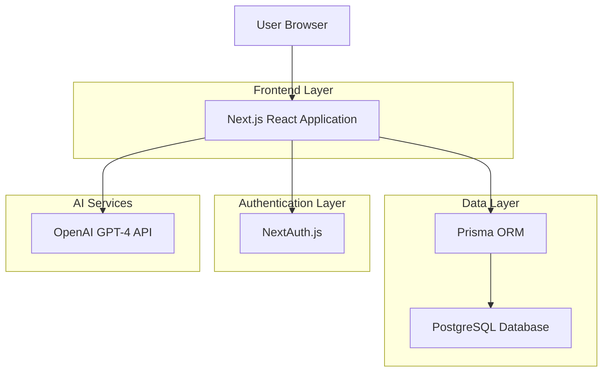
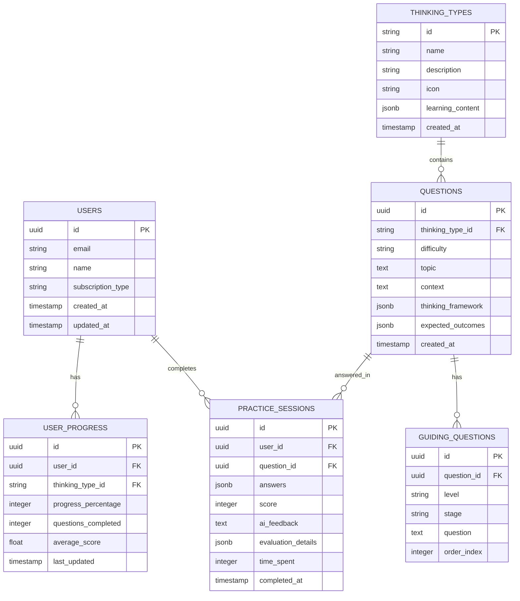

# 批判性思维学习体系技术架构文档

## 1.Architecture design (基于现有系统架构)



## 2.Technology Description (基于现有技术栈)

- Frontend: Next.js@14 + React@18 + TypeScript + Tailwind CSS
- Database: PostgreSQL + Prisma ORM
- Authentication: NextAuth.js
- AI Service: OpenAI GPT-4 API
- Deployment: 基于现有部署架构

## 3. 路由定义

| 路由 | 用途 |
|------|------|
| /learn | 学习中心主页，展示五种思维类型概览 |
| /learn/types/[type] | 具体思维类型详情页 (causal-analysis, premise-challenge 等) |
| /learn/daily | 每日练习主页，练习题目选择和历史 |
| /learn/practice/[id] | 具体练习题目详情和答题界面 |
| /learn/progress | 学习进度页面，能力分析和统计 |
| /learn/achievements | 成就系统页面，徽章和里程碑 |

## 4. API 定义

### 4.1 核心 API

**获取思维类型列表**
```
GET /api/thinking-types
```

Response:
| 参数名 | 参数类型 | 描述 |
|--------|----------|------|
| types | ThinkingType[] | 思维类型列表 |

**获取练习题目**
```
GET /api/practice/questions
```

Request:
| 参数名 | 参数类型 | 是否必需 | 描述 |
|--------|----------|----------|------|
| type | string | false | 思维类型筛选 |
| difficulty | string | false | 难度等级 (beginner/intermediate/advanced) |
| limit | number | false | 返回数量限制 |

Response:
| 参数名 | 参数类型 | 描述 |
|--------|----------|------|
| questions | Question[] | 练习题目列表 |
| total | number | 总题目数量 |

**提交练习答案**
```
POST /api/practice/submit
```

Request:
| 参数名 | 参数类型 | 是否必需 | 描述 |
|--------|----------|----------|------|
| questionId | string | true | 题目ID |
| answers | Answer[] | true | 分层级答案 |
| timeSpent | number | true | 答题用时(秒) |

Response:
| 参数名 | 参数类型 | 描述 |
|--------|----------|------|
| evaluation | Evaluation | AI评估结果 |
| score | number | 得分 (0-100) |
| feedback | string | 详细反馈 |
| suggestions | string[] | 改进建议 |

**获取学习进度**
```
GET /api/progress
```

Response:
| 参数名 | 参数类型 | 描述 |
|--------|----------|------|
| overallProgress | number | 整体进度百分比 |
| typeProgress | TypeProgress[] | 各类型进度详情 |
| practiceStats | PracticeStats | 练习统计数据 |
| abilityRadar | AbilityScore[] | 能力雷达图数据 |

示例响应:
```json
{
  "overallProgress": 65,
  "typeProgress": [
    {
      "type": "causal_analysis",
      "progress": 80,
      "questionsCompleted": 12,
      "averageScore": 85
    }
  ],
  "practiceStats": {
    "totalQuestions": 45,
    "correctRate": 78,
    "totalTimeSpent": 3600
  }
}
```

## 5. 数据模型

### 5.1 数据模型定义



### 5.2 数据定义语言

**用户表 (users)**
```sql
-- 创建用户表
CREATE TABLE users (
    id UUID PRIMARY KEY DEFAULT gen_random_uuid(),
    email VARCHAR(255) UNIQUE NOT NULL,
    name VARCHAR(100) NOT NULL,
    subscription_type VARCHAR(20) DEFAULT 'free' CHECK (subscription_type IN ('free', 'premium')),
    created_at TIMESTAMP WITH TIME ZONE DEFAULT NOW(),
    updated_at TIMESTAMP WITH TIME ZONE DEFAULT NOW()
);

-- 创建索引
CREATE INDEX idx_users_email ON users(email);
CREATE INDEX idx_users_subscription ON users(subscription_type);
```

**思维类型表 (thinking_types)**
```sql
-- 创建思维类型表
CREATE TABLE thinking_types (
    id VARCHAR(50) PRIMARY KEY,
    name VARCHAR(100) NOT NULL,
    description TEXT NOT NULL,
    icon VARCHAR(50) NOT NULL,
    learning_content JSONB NOT NULL,
    created_at TIMESTAMP WITH TIME ZONE DEFAULT NOW()
);

-- 插入初始数据
INSERT INTO thinking_types (id, name, description, icon, learning_content) VALUES
('causal_analysis', '多维归因与利弊权衡', '跳出非黑即白判断，从经济、社会、伦理等维度拆解矛盾，权衡方案的成本与收益', 'search', '{"framework": "多维度分析", "methods": ["经济分析", "社会影响", "伦理考量"]}'),
('premise_challenge', '前提质疑与方法批判', '审视学科内经典理论/实验的前提假设，识别研究局限性', 'help-circle', '{"framework": "科学方法论", "methods": ["假设识别", "局限性分析", "改进设计"]}'),
('fallacy_detection', '逻辑谬误识别与证据评估', '脱离内容本身审视论证过程严谨性，识别各种逻辑谬误', 'scale', '{"framework": "逻辑分析", "methods": ["谬误识别", "证据评估", "论证重构"]}'),
('iterative_reflection', '自我认知与观点迭代', '审视自身过往判断，承认认知局限，基于新信息调整观点', 'refresh-cw', '{"framework": "元认知", "methods": ["自我反思", "认知升级", "观点迭代"]}'),
('connection_transfer', '跨领域关联与迁移', '打破学科边界，识别不同领域问题的共性逻辑，进行方法迁移', 'link', '{"framework": "类比思维", "methods": ["模式识别", "方法迁移", "创新应用"]}');
```

**练习题目表 (questions)**
```sql
-- 创建练习题目表
CREATE TABLE questions (
    id UUID PRIMARY KEY DEFAULT gen_random_uuid(),
    thinking_type_id VARCHAR(50) REFERENCES thinking_types(id),
    difficulty VARCHAR(20) NOT NULL CHECK (difficulty IN ('beginner', 'intermediate', 'advanced')),
    topic TEXT NOT NULL,
    context TEXT NOT NULL,
    thinking_framework JSONB NOT NULL,
    expected_outcomes JSONB NOT NULL,
    created_at TIMESTAMP WITH TIME ZONE DEFAULT NOW()
);

-- 创建索引
CREATE INDEX idx_questions_type ON questions(thinking_type_id);
CREATE INDEX idx_questions_difficulty ON questions(difficulty);
CREATE INDEX idx_questions_created_at ON questions(created_at DESC);
```

**引导问题表 (guiding_questions)**
```sql
-- 创建引导问题表
CREATE TABLE guiding_questions (
    id UUID PRIMARY KEY DEFAULT gen_random_uuid(),
    question_id UUID REFERENCES questions(id) ON DELETE CASCADE,
    level VARCHAR(20) NOT NULL CHECK (level IN ('beginner', 'intermediate', 'advanced')),
    stage VARCHAR(50) NOT NULL,
    question TEXT NOT NULL,
    order_index INTEGER NOT NULL,
    UNIQUE(question_id, level, order_index)
);

-- 创建索引
CREATE INDEX idx_guiding_questions_question_id ON guiding_questions(question_id);
CREATE INDEX idx_guiding_questions_level ON guiding_questions(level);
```

**用户进度表 (user_progress)**
```sql
-- 创建用户进度表
CREATE TABLE user_progress (
    id UUID PRIMARY KEY DEFAULT gen_random_uuid(),
    user_id UUID REFERENCES users(id) ON DELETE CASCADE,
    thinking_type_id VARCHAR(50) REFERENCES thinking_types(id),
    progress_percentage INTEGER DEFAULT 0 CHECK (progress_percentage >= 0 AND progress_percentage <= 100),
    questions_completed INTEGER DEFAULT 0,
    average_score DECIMAL(5,2) DEFAULT 0,
    last_updated TIMESTAMP WITH TIME ZONE DEFAULT NOW(),
    UNIQUE(user_id, thinking_type_id)
);

-- 创建索引
CREATE INDEX idx_user_progress_user_id ON user_progress(user_id);
CREATE INDEX idx_user_progress_type ON user_progress(thinking_type_id);
```

**练习会话表 (practice_sessions)**
```sql
-- 创建练习会话表
CREATE TABLE practice_sessions (
    id UUID PRIMARY KEY DEFAULT gen_random_uuid(),
    user_id UUID REFERENCES users(id) ON DELETE CASCADE,
    question_id UUID REFERENCES questions(id),
    answers JSONB NOT NULL,
    score INTEGER CHECK (score >= 0 AND score <= 100),
    ai_feedback TEXT,
    evaluation_details JSONB,
    time_spent INTEGER NOT NULL, -- 秒数
    completed_at TIMESTAMP WITH TIME ZONE DEFAULT NOW()
);

-- 创建索引
CREATE INDEX idx_practice_sessions_user_id ON practice_sessions(user_id);
CREATE INDEX idx_practice_sessions_question_id ON practice_sessions(question_id);
CREATE INDEX idx_practice_sessions_completed_at ON practice_sessions(completed_at DESC);
CREATE INDEX idx_practice_sessions_score ON practice_sessions(score DESC);
```

**权限设置**
```sql
-- 为匿名用户授予基本读取权限
GRANT SELECT ON thinking_types TO anon;
GRANT SELECT ON questions TO anon;
GRANT SELECT ON guiding_questions TO anon;

-- 为认证用户授予完整权限
GRANT ALL PRIVILEGES ON users TO authenticated;
GRANT ALL PRIVILEGES ON user_progress TO authenticated;
GRANT ALL PRIVILEGES ON practice_sessions TO authenticated;
GRANT SELECT ON thinking_types TO authenticated;
GRANT SELECT ON questions TO authenticated;
GRANT SELECT ON guiding_questions TO authenticated;
```