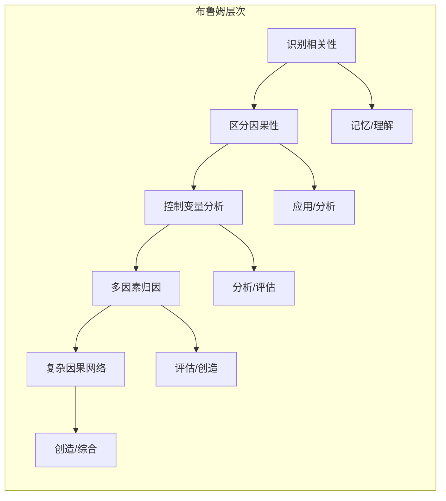
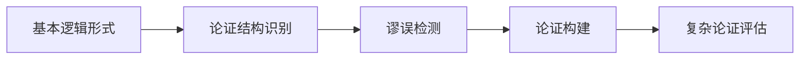
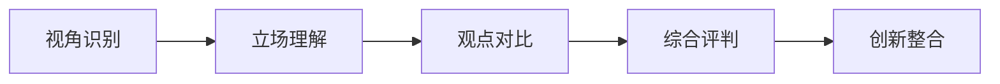
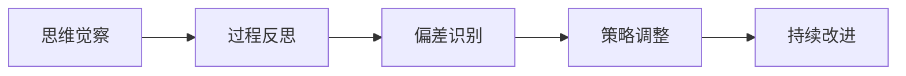

# 批判性思维教育内容体系框架

## 📚 内容体系概述

### 理论基础

本内容体系基于以下认知科学理论构建：

1. **布鲁姆认知层次理论**：从记忆、理解到分析、评估、创造的递进式认知发展
2. **维果茨基最近发展区理论**：在学习者当前能力与潜在能力之间设计适宜的挑战
3. **认知负荷理论**：合理分配内在、外在和相关认知负荷，优化学习效果
4. **建构主义学习理论**：通过主动建构知识，培养深层理解和批判性思维
5. **社会认知理论**：通过观察学习和社会互动促进思维能力发展

### 设计原则

- **渐进性**：从具体到抽象，从简单到复杂的螺旋式上升
- **个性化**：基于学习者认知风格和能力水平的自适应内容
- **实用性**：与真实世界问题和学术需求紧密结合
- **反思性**：强调元认知和自我调节学习能力

## 🎯 五大核心思维维度

### 1. 因果分析与归因 (Causal Analysis)

#### 认知发展路径

#### 学习内容结构

**Level 1: 基础识别 (认知负荷: 低)**
- 学习目标：区分相关性与因果性的基本概念
- 内容形式：
  - 交互式动画：展示相关性vs因果性的经典案例
  - 游戏化练习：拖拽式分类游戏，将现象分为"相关"或"因果"
  - 微视频：3分钟解释"冰淇淋销量与溺水事件"等经典案例
- 评估方式：选择题 + 简单案例判断
- 思维脚手架：提供"时间顺序检查表"、"第三变量提示卡"

**Level 2: 变量控制 (认知负荷: 中等)**
- 学习目标：理解控制变量的重要性，识别混淆因素
- 内容形式：
  - 虚拟实验室：模拟科学实验，学习控制变量方法
  - 案例分析：分析新闻报道中的因果声明，识别未控制的变量
  - 协作讨论：小组讨论"教育投入与学业成绩"等复杂话题
- 评估方式：实验设计题 + 案例分析报告
- 思维脚手架：提供"变量识别框架"、"实验设计模板"

**Level 3: 多因素归因 (认知负荷: 中高)**
- 学习目标：分析多个因素如何共同影响结果
- 内容形式：
  - 系统动力学模拟：探索复杂系统中的因果关系
  - 真实案例研究：分析历史事件、社会现象的多重原因
  - 辩论活动：就复杂社会问题进行多角度因果分析
- 评估方式：因果图绘制 + 多因素分析报告
- 思维脚手架：提供"因果链分析工具"、"权重评估矩阵"

**Level 4: 因果网络构建 (认知负荷: 高)**
- 学习目标：构建复杂的因果关系网络，理解系统性思维
- 内容形式：
  - 概念建模工具：使用专业软件构建因果关系图
  - 跨学科项目：整合多个学科知识分析复杂问题
  - 专家对话：与领域专家讨论复杂因果关系
- 评估方式：因果网络模型 + 同伴评议
- 思维脚手架：提供"系统思维框架"、"反馈回路识别指南"

**Level 5: 创新应用 (认知负荷: 高)**
- 学习目标：将因果分析应用于创新问题解决
- 内容形式：
  - 开放性项目：设计解决真实世界问题的方案
  - 研究设计：制定原创性研究计划
  - 政策分析：评估政策干预的潜在因果效应
- 评估方式：创新项目展示 + 专家评估
- 思维脚手架：提供"创新思维工具包"、"影响评估框架"

### 2. 逻辑推理与论证 (Logical Reasoning)

#### 认知发展路径

#### 学习内容结构

**Level 1: 逻辑基础**
- 演绎推理：三段论、条件推理、析取推理
- 归纳推理：模式识别、概括、统计推理
- 类比推理：相似性识别、结构映射
- 学习活动：
  - 逻辑拼图游戏：通过游戏化方式学习基本逻辑形式
  - 推理链构建：拖拽式界面构建推理过程
  - 日常推理练习：分析日常对话中的推理模式

**Level 2: 论证分析**
- 论证结构：前提、结论、推理过程
- 论证类型：演绎论证、归纳论证、溯因论证
- 论证强度：有效性、可靠性、说服力
- 学习活动：
  - 论证解构器：AI辅助分析文本中的论证结构
  - 论证可视化：将复杂论证转化为图形结构
  - 论证重构：改进弱论证，增强说服力

**Level 3: 谬误识别**
- 形式谬误：肯定后件、否定前件等
- 非形式谬误：人身攻击、稻草人、滑坡等
- 认知偏差：确认偏差、可得性启发等
- 学习活动：
  - 谬误侦探游戏：在模拟辩论中识别各种谬误
  - 媒体批判：分析新闻报道和广告中的逻辑问题
  - 自我反思：识别自己思维中的偏差和谬误

**Level 4: 论证构建**
- 论证规划：确定目标、分析受众、选择策略
- 证据收集：评估证据质量、多样性、相关性
- 反驳预期：预见反对意见，准备回应策略
- 学习活动：
  - 辩论准备：为正式辩论准备论证材料
  - 说服性写作：撰写有说服力的议论文
  - 口头论证：进行结构化的口头陈述

**Level 5: 复杂论证评估**
- 多层论证：嵌套论证、并行论证、收敛论证
- 论证对话：论证与反驳的动态过程
- 论证伦理：公平论证、诚实表达、尊重对手
- 学习活动：
  - 学术论文评议：评估同伴的研究论证
  - 政策辩论：参与复杂社会议题的多方辩论
  - 哲学对话：探讨深层哲学问题的论证

### 3. 多元视角与批判 (Multi-Perspective Analysis)

#### 认知发展路径

#### 学习内容结构

**Level 1: 视角意识**
- 视角概念：个人经历、文化背景、利益立场如何影响观点
- 视角多样性：认识到同一问题可以有多种合理观点
- 视角转换：尝试从他人角度思考问题
- 学习活动：
  - 角色扮演：扮演不同身份的人讨论同一问题
  - 视角轮盘：随机分配不同立场进行讨论
  - 文化探索：了解不同文化对同一现象的理解

**Level 2: 立场分析**
- 利益相关者分析：识别问题涉及的各方利益
- 价值观差异：理解不同价值观如何导致不同观点
- 权力关系：分析权力结构如何影响话语权
- 学习活动：
  - 利益相关者地图：绘制复杂问题的利益相关者网络
  - 价值观辩论：基于不同价值观进行结构化辩论
  - 权力分析：分析社会议题中的权力动态

**Level 3: 观点对比**
- 观点分类：将不同观点按照维度进行分类
- 共同点识别：寻找不同观点之间的共识基础
- 分歧分析：深入理解分歧的根本原因
- 学习活动：
  - 观点矩阵：制作多维度观点对比表
  - 共识寻找：在分歧中寻找可能的共同立场
  - 分歧溯源：追溯观点分歧的深层原因

**Level 4: 批判性评估**
- 观点质量：评估不同观点的逻辑性、证据支持、一致性
- 偏见识别：识别各种观点中可能存在的偏见
- 建设性批评：提出有建设性的质疑和改进建议
- 学习活动：
  - 观点评估：使用标准化框架评估不同观点
  - 偏见检测：识别媒体报道和学术文献中的偏见
  - 建设性对话：进行尊重而深入的批判性讨论

**Level 5: 综合创新**
- 观点整合：将不同观点的合理部分整合为新观点
- 创新思维：基于多元视角产生创新见解
- 平衡判断：在复杂情况下做出平衡的判断
- 学习活动：
  - 综合报告：整合多方观点形成平衡的分析报告
  - 创新方案：基于多元视角设计创新解决方案
  - 调解模拟：在模拟冲突中寻找各方都能接受的方案

### 4. 反思迭代与元认知 (Reflective Iteration)

#### 认知发展路径

