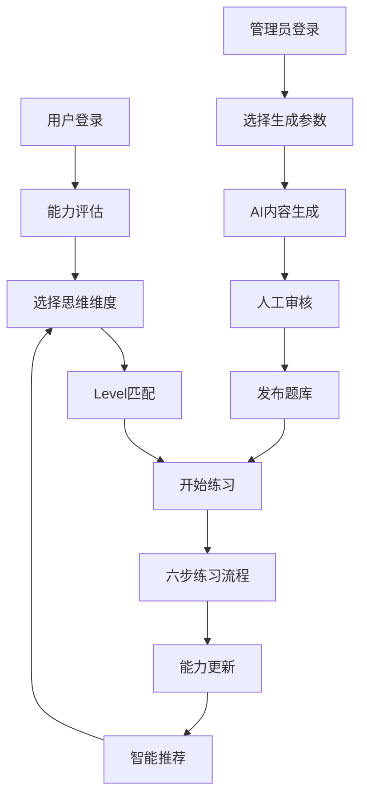

# 批判性思维教育系统升级产品需求文档

## 1. 产品概述

本项目旨在基于认知科学理论，构建一个层次化、个性化的批判性思维教育系统。通过AI驱动的内容生成和自适应学习路径，为用户提供从Level 1到Level 5的渐进式思维训练体验。

- **核心价值**：将抽象的批判性思维能力转化为可测量、可训练的具体技能，通过科学的认知发展路径帮助用户系统性提升思维品质。
- **目标用户**：学生、教育工作者、职场人士等希望提升批判性思维能力的用户群体。

## 2. 核心功能

### 2.1 用户角色

| 角色 | 注册方式 | 核心权限 |
|------|----------|----------|
| 普通用户 | 邮箱注册 | 访问练习系统、查看个人进度、使用基础学习功能 |
| 管理员 | 系统分配 | 内容管理、题库生成、用户数据分析、系统配置 |

### 2.2 功能模块

本系统包含以下核心页面：

1. **学习中心页面**：五大思维维度展示、个人进度概览、推荐学习路径
2. **层次化练习页面**：基于Level 1-5的渐进式练习流程
3. **Admin内容管理页面**：AI驱动的题库生成、内容审核、模板管理
4. **进度追踪页面**：详细的学习分析、能力雷达图、成就系统
5. **个性化推荐页面**：基于学习数据的智能内容推荐

### 2.3 页面详情

| 页面名称 | 模块名称 | 功能描述 |
|----------|----------|----------|
| 学习中心 | 思维维度导航 | 展示五大核心思维维度，显示每个维度的当前Level和进度 |
| 学习中心 | 个人仪表板 | 学习时长统计、练习次数、掌握度分析、近期成就 |
| 学习中心 | 智能推荐 | 基于当前能力水平推荐最适合的练习内容和难度 |
| 层次化练习 | Level识别系统 | 自动识别用户当前Level，提供相应难度的练习内容 |
| 层次化练习 | 六步练习流程 | 概念学习→题目呈现→引导思考→完整作答→评估反馈→反思总结 |
| 层次化练习 | 自适应调整 | 根据答题表现动态调整题目难度和引导策略 |
| Admin管理 | AI题库生成 | 基于思维框架自动生成符合Level要求的练习题目 |
| Admin管理 | 内容审核 | 人工审核AI生成内容，确保质量和准确性 |
| Admin管理 | 模板管理 | 管理不同思维维度和Level的题目模板 |
| 进度追踪 | 能力分析 | 五维雷达图展示各思维维度的掌握程度 |
| 进度追踪 | 学习路径 | 可视化展示用户的学习轨迹和下一步建议 |
| 进度追踪 | 成就系统 | 基于学习里程碑的徽章和认证系统 |

## 3. 核心流程

### 3.1 用户学习流程

用户进入系统后，首先进行能力评估，系统根据评估结果为用户匹配合适的起始Level。然后用户可以选择感兴趣的思维维度开始练习：

1. **能力评估** → 确定起始Level
2. **选择维度** → 进入对应的思维训练
3. **层次化练习** → 按照六步流程完成练习
4. **进度更新** → 系统更新用户能力模型
5. **智能推荐** → 推荐下一个练习内容

### 3.2 Admin内容管理流程

管理员可以通过AI辅助快速生成大量高质量的练习内容：

1. **选择维度和Level** → 确定生成目标
2. **配置生成参数** → 设置题目类型、难度、数量等
3. **AI内容生成** → 系统自动生成题目和解析
4. **人工审核** → 管理员审核和优化内容
5. **发布上线** → 内容进入题库供用户使用

## 4. 用户界面设计

### 4.1 设计风格

- **主色调**：深蓝色(#1e40af)作为主色，浅蓝色(#3b82f6)作为辅助色
- **按钮风格**：圆角矩形，渐变背景，微阴影效果
- **字体**：Inter字体，标题18-24px，正文14-16px
- **布局风格**：卡片式设计，响应式网格布局，顶部导航
- **图标风格**：线性图标，配合思维导图和流程图可视化

### 4.2 页面设计概览

| 页面名称 | 模块名称 | UI元素 |
|----------|----------|--------|
| 学习中心 | 思维维度卡片 | 五个大卡片，每个显示维度名称、当前Level、进度条、开始练习按钮 |
| 学习中心 | 进度仪表板 | 圆形进度图、数字统计、最近成就展示、学习时长图表 |
| 层次化练习 | Level指示器 | 顶部进度条显示Level 1-5，当前Level高亮 |
| 层次化练习 | 六步流程 | 水平步骤条，每步显示图标和名称，完成步骤变绿 |
| Admin管理 | 生成配置面板 | 下拉选择框、滑块、复选框、预览区域 |
| Admin管理 | 内容列表 | 表格展示，支持筛选、排序、批量操作 |

### 4.3 响应式设计

- **桌面优先**：主要面向桌面用户的深度学习体验
- **移动适配**：关键功能在移动端可用，练习流程优化触屏交互
- **触屏优化**：按钮尺寸适合手指点击，支持滑动和手势操作